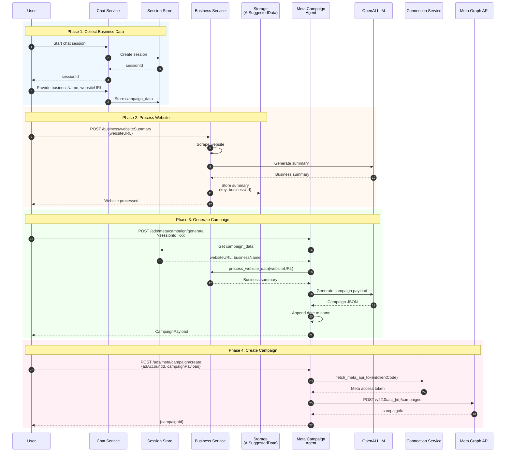

# Meta Ads Campaign Agent

## Overview

This module provides intelligent Meta (Facebook) campaign creation using LLM-based generation.

## Architecture

```
agents/meta/
├── __init__.py
├── campaign_agent.py    # Main agent logic
└── README.md

adapters/meta/
├── __init__.py
├── client.py            # HTTP client for Meta Graph API
├── campaigns.py         # Campaign CRUD adapter
├── models.py            # Pydantic models
└── exceptions.py        # MetaAPIError

prompts/meta/
└── campaign.txt         # LLM prompt template
```

## Flow Diagram



## API Endpoints

### Generate Campaign

```bash
POST /api/ds/ads/meta/campaign/generate?sessionId=xxx
```

**Headers:**
- `access-token`: Internal access token
- `clientCode`: Client code

**Response:**
```json
{
  "success": true,
  "data": {
    "name": "Business Name - Lead Gen Campaign - 2026-02-01",
    "objective": "OUTCOME_LEADS",
    "special_ad_categories": ["HOUSING"],
    "special_ad_category_country": ["IN"]
  }
}
```

### Create Campaign

```bash
POST /api/ds/ads/meta/campaign/create
```

**Headers:**
- `clientCode`: Client code (used to fetch Meta token from connection service)

**Body:**
```json
{
  "adAccountId": "123456789",
  "campaignPayload": {
    "name": "Campaign Name - 2026-02-01",
    "objective": "OUTCOME_LEADS",
    "special_ad_categories": ["NONE"],
    "special_ad_category_country": ["US"]
  }
}
```

**Response:**
```json
{
  "success": true,
  "data": {
    "campaignId": "120211234567890"
  }
}
```

## Valid Values

### Objectives
- `OUTCOME_LEADS`
- `OUTCOME_TRAFFIC`
- `OUTCOME_AWARENESS`

### Special Ad Categories
- `HOUSING`
- `EMPLOYMENT`
- `CREDIT`
- `ISSUES_ELECTIONS_POLITICS`
- `NONE`

## Token Management

Meta access tokens are fetched from the connection service using `fetch_meta_api_token(client_code)`. The token is retrieved per-request based on the `clientCode` header.

For local development, tokens can be configured in the connection service or via environment variables.
