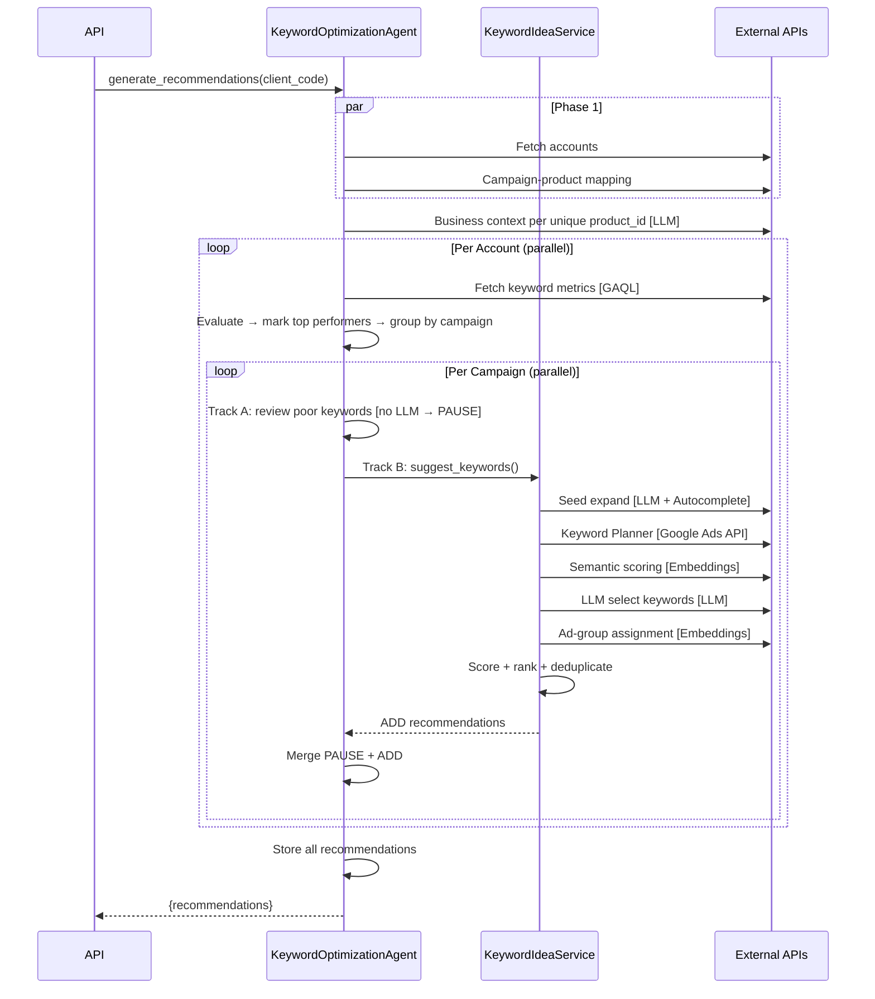
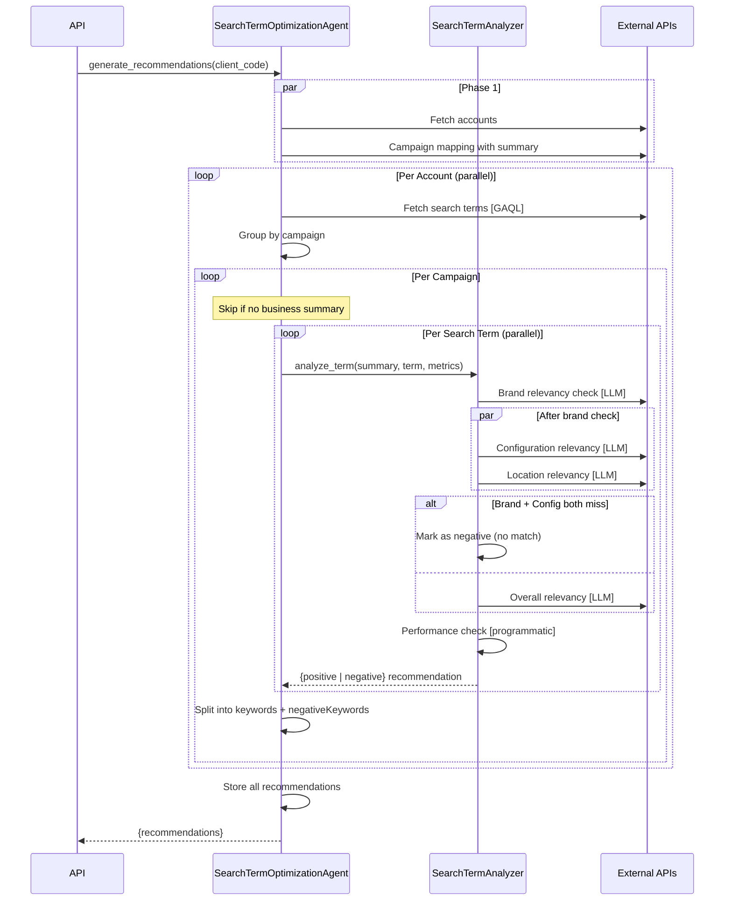
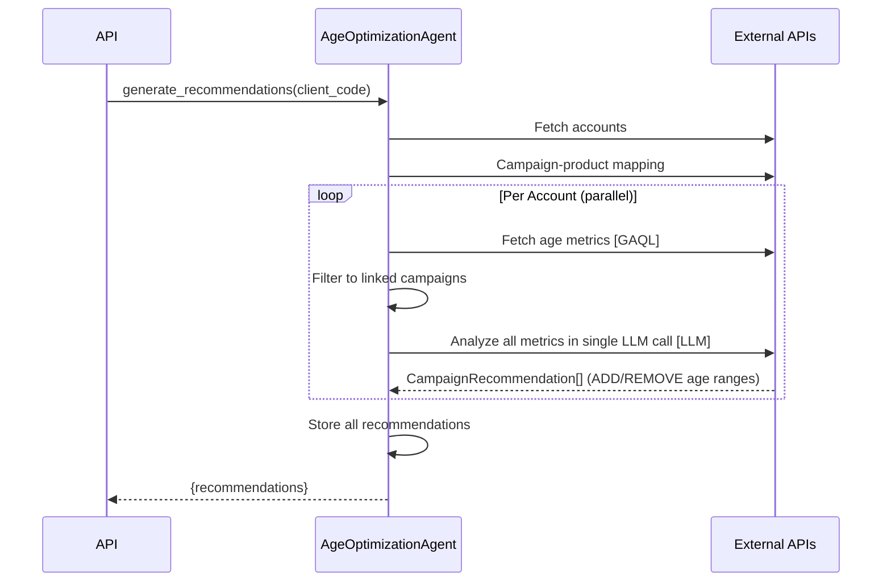
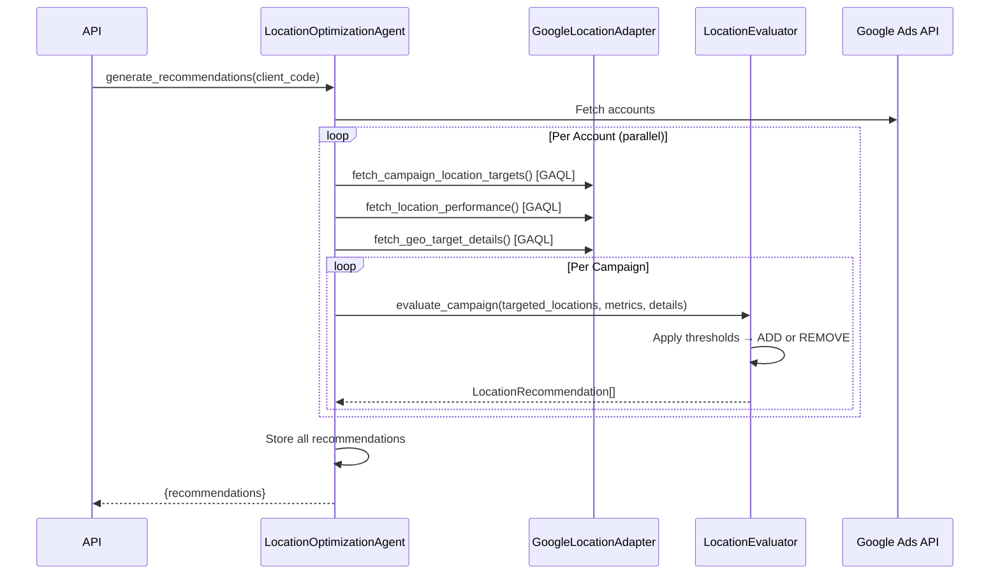
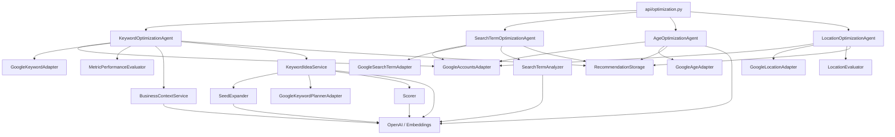

# Optimization Agents

All optimization agents share: `api/optimization.py` entry point, `CampaignRecommendation` model, parallel account processing, and `recommendation_storage_service` for persistence.

## Shared Components

| File | Purpose |
|------|---------|
| `api/optimization.py` | API routes (`/api/ds/optimize/{age,search-terms,keywords,locations}`) |
| `adapters/google/accounts.py` | Fetch accessible accounts for a client |
| `core/models/optimization.py` | `CampaignRecommendation`, `KeywordRecommendation`, `OptimizationFields` |
| `core/services/recommendation_storage.py` | Store recommendations, merge by origin |
| `core/services/metric_evaluator_config.py` | Shared thresholds config + `group_by_campaign()` |
| `core/services/metric_performance_evaluator.py` | Evaluate performance (good/poor/top) — used by keyword + search_term |
| `core/services/business_context_service.py` | Business metadata + features extraction (shared) |

---

## 1. Keyword Optimization

`POST /api/ds/optimize/keywords` → `KeywordOptimizationAgent`

### Flow

### File Map

| File | Purpose |
|------|---------|
| `agents/optimization/keyword_optimization_agent.py` | Orchestrator — accounts, campaigns, Track A (PAUSE) |
| `core/keyword/idea_service.py` | Track B — seed expand → planner → score → LLM select → deduplicate |
| `core/keyword/scorer.py` | Semantic scoring, ad-group assignment, multi-factor scoring |
| `core/keyword/seed_expander.py` | LLM seed generation + Google Autocomplete expansion |
| `adapters/google/optimization/keyword.py` | Fetch keyword metrics via GAQL |
| `adapters/google/optimization/keyword_planner.py` | Google Keyword Planner API (generateKeywordIdeas) |
| `prompts/optimization/keyword_suggestion_prompt.txt` | LLM keyword selection prompt |

### Scoring

5-factor weighted score (min threshold: 40):

| Factor | Weight | Source |
|--------|--------|--------|
| Volume | 0.25 | Google Keyword Planner |
| Competition | 0.20 | Google Keyword Planner |
| Business relevance | 0.25 | LLM selection |
| Intent | 0.15 | LLM selection |
| Semantic similarity | 0.15 | Embeddings vs top keywords |

### LLM Calls Per Campaign

1. Seed expansion (gpt-4o-mini)
2. Keyword selection (gpt-4o-mini)
3. Embeddings x2 (semantic scoring + ad-group assignment)

Business context calls are shared across campaigns with same `product_id`.

### Anti-Hallucination

- LLM-selected keywords merged with original Google data (`{**llm, **google}`) — Google metrics overwrite LLM values
- Keywords not in Google suggestions are skipped
- Existing campaign keywords excluded via case-insensitive deduplication

### Old Flow

`services/google_kw_update_service/` — marked with TODO for removal. See `claudeplans/keyword_old_vs_new.md` for detailed comparison.

---

## 2. Search Term Optimization

`POST /api/ds/optimize/search-terms` → `SearchTermOptimizationAgent`

### Flow

### File Map

| File | Purpose |
|------|---------|
| `agents/optimization/search_term_optimization_agent.py` | Orchestrator — accounts, campaigns, term analysis |
| `core/search_term/analyzer.py` | Multi-step relevancy analysis (brand → config → location → overall → performance) |
| `adapters/google/optimization/search_term.py` | Fetch search terms via GAQL |
| `prompts/optimization/search_term/*.txt` | Relevancy check prompts (brand, configuration, location, overall) |

### Analysis Pipeline

Each search term goes through 5 checks:

| Check | Type | Purpose |
|-------|------|---------|
| Brand | LLM | Is it our brand, competitor, or generic? |
| Configuration | LLM | Does it match product/service config? |
| Location | LLM | Is it geographically relevant? (skipped for competitor brands) |
| Overall | LLM | Combined relevancy + intent stage + suggestion type |
| Performance | Programmatic | Cost per conversion vs threshold (₹4000) |

### LLM Calls Per Search Term

- 3-4 relevancy checks (brand + config + location + overall)
- Overall check skipped if both brand and config miss (early exit)

### Output

Recommendations split into:
- `keywords` — positive: high-relevancy terms to add as keywords
- `negativeKeywords` — negative: irrelevant terms to block

### Old Flow

`services/search_term_service.py` + `services/search_term_pipeline.py` — marked with TODO in `ads_api.py`.

---

## 3. Age Optimization

`POST /api/ds/optimize/age` → `AgeOptimizationAgent`

### Flow

### File Map

| File | Purpose |
|------|---------|
| `agents/optimization/age_optimization_agent.py` | Orchestrator — accounts, metrics, LLM analysis |
| `adapters/google/optimization/age.py` | Fetch age range metrics via GAQL |
| `prompts/optimization/age_optimization_prompt.txt` | LLM analysis prompt |

### How It Works

- Fetches age range performance (impressions, clicks, conversions, cost) per ad group
- Calculates derived metrics (CTR, CPA, CPC)
- Sends all metrics to LLM in a single call → LLM returns structured `CampaignRecommendation[]`
- Recommendations: ADD (target underserved age ranges) or REMOVE (exclude poor-performing ones)

### LLM Calls Per Account

- 1 call with all campaign metrics (gpt-4o-mini)

### Old Flow

`services/age_optimization_service.py` — marked with TODO in `ads_api.py`.

---

## 4. Location Optimization

`POST /api/ds/optimize/locations` → `LocationOptimizationAgent`

### Flow

### File Map

| File | Purpose |
|------|---------|
| `agents/optimization/location_optimization_agent.py` | Orchestrator — accounts, campaigns, evaluation |
| `core/services/location_evaluator.py` | Rule-based evaluation (thresholds for ADD/REMOVE) |
| `adapters/google/optimization/location.py` | 3 GAQL queries: targets, performance, geo details |

### How It Works

- Fetches current location targets, last-30-day location performance, and geo target metadata (3 GAQL queries per account)
- `LocationEvaluator` applies purely programmatic thresholds — **zero LLM calls**
- Recommendations: ADD (target converting non-targeted locations) or REMOVE (exclude non-converting high-spend locations)
- ADD recommendations with unknown location names are filtered out

### Evaluation Thresholds

| Recommendation | Condition | Reason |
|----------------|-----------|--------|
| **REMOVE** | Targeted location with clicks ≥ 50, spend > ₹10, conversions = 0 | High spend & clicks but zero conversions |
| **ADD** | Non-targeted location with conversions > 0 | Conversions from non-targeted location |

### LLM Calls

None — entirely rule-based.

### Metrics Collected

Impressions, clicks, conversions, cost (INR), CTR (%), avg CPC (INR), CPL (INR), conversion rate (%).

---

## Architecture Overview

