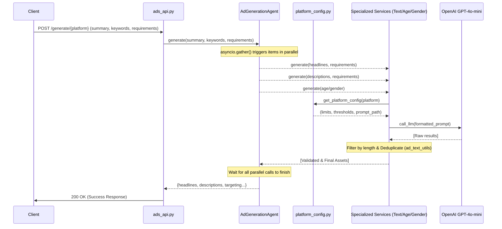

# Ad Generation System Documentation

This document describes the architecture, implementation flow, and configuration of the ad generation system for Google and Meta Ads.

## Overview

The Ad Generation system transforms a business summary and keywords into platform-specific ad assets (headlines, descriptions, and targeting) using a modular, parallelized, and configuration-driven architecture.

### Key Components
- **MetaAdGenerationAgent**: Orchestrates asset generation for Meta (Facebook/Instagram).
- **GoogleAdGenerationAgent**: Orchestrates asset generation for Google Ads.
- **AdTextService**: A unified service for generating all text-based assets (headlines, descriptions, primary text).
- **AgeTargetingService / GenderTargetingService**: Specialized services for audience prediction.

---

## Execution Flow

The system uses `asyncio.gather` to concurrently generate multiple assets, reducing latency from ~60s in the legacy version to ~15s.

---

## File Mapping

| Layer | File | Responsibility |
| :--- | :--- | :--- |
| **API** | `apis/ads_api.py` | FastAPI endpoints for Google and Meta generation. |
| **Orchestration** | `agents/generation/*.py` | Platform-specific agents that orchestrate parallel service calls. |
| **Service** | `services/generation/ad_text_service.py` | Core text generation logic with retries and quality checks. |
| **Service** | `services/generation/age_service.py` | Specialized AI targeting for age ranges. |
| **Service** | `services/generation/gender_service.py` | Specialized AI targeting for gender. |
| **Config** | `services/generation/platform_config.py` | Centralized constraints (character limits, counts, similarity) and prompt paths. |
| **Prompts** | `prompts/generation/*.txt` | Specialized instructions for each asset type. |
| **Utils** | `services/generation/ad_text_utils.py` | Shared logic for filtering, deduplication, and retry backoff. |

---

## Custom Requirements (Tone Setting)

The system supports a `requirements` field in the API request, which is passed directly to the LLM as custom instructions.

**Usage Examples:**
- **Tone**: `"requirements": "Use a sophisticated and exclusive tone."`
- **Specific Offers**: `"requirements": "Mention the limited-time 20% summer discount."`
- **Style**: `"requirements": "Write in short, punchy sentences."`

These instructions are dynamically inserted into the prompt template for all text-based assets.

---

## Improvements Over Legacy Version

The new architecture replaces the legacy `AdAssetsGenerator` (`services/ads_service.py`) and addresses several issues:

1.  **Parallel vs. Sequential**: Parallel execution reduces total API wait time by ~75%.
2.  **Specialized Prompts**: Using dedicated prompts for each asset type (instead of one monolithic prompt) prevents "prompt dilution" and ensures higher quality output.
3.  **Config-Driven**: Constraints are managed centrally in `platform_config.py`, making it easy to adjust character limits or similarity thresholds without changing code logic.
4.  **Granular Retries**: Failure in one component (e.g., age targeting) no longer restarts the entire generation process for other settled assets.
