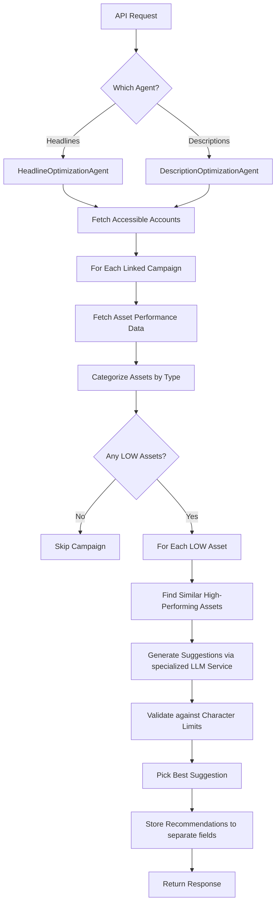

# Asset Optimization Service Documentation

## Overview

The Asset Optimization Service identifies low-performing ad assets (headlines and descriptions) in Google Ads campaigns and generates high-performing replacement suggestions. The service is split into two specialized agents:
1. **Headline Optimization Agent**: Specifically handles headline assets (max 30 characters).
2. **Description Optimization Agent**: Specifically handles description assets (max 90 characters).

Both agents utilize shared core utilities for categorization, similarity matching, and validation.

---

## Architecture

### Components

The system follows a modular architecture where specialized agents orchestrate the workflow using shared core components.

```
Optimization Agents (Headline / Description)
├── GoogleAccountsAdapter (fetch accounts)
├── GoogleAssetsAdapter (fetch performance & asset data)
├── core.optimization.AssetCategorizer (tier classification)
├── core.optimization.SimilarityMatcher (semantic matching)
├── core.optimization.AssetValidator (suggestion validation)
└── services (HeadlineGenerator / DescriptionGenerator)
```

### Workflow



---

## API Reference

### Endpoints

| Method | Endpoint | Description |
|--------|----------|-------------|
| `POST` | `/api/ds/optimize/headlines` | Triggers optimization for Headlines |
| `POST` | `/api/ds/optimize/descriptions` | Triggers optimization for Descriptions |

### Headers

| Header | Type | Required | Description |
|--------|------|----------|-------------|
| `clientCode` | string | Yes | Client identifier for authentication and mapping |

### Response Format

Standardized `OptimizationResponse` with results grouped by campaign.

```json
{
  "status": "success",
  "data": {
    "recommendations": [
      {
        "platform": "google_ads",
        "account_id": "9876543210",
        "campaign_id": "campaign_456",
        "fields": {
          "headlines": [ ... ],     // Populated by Headline Agent
          "descriptions": [ ... ]   // Populated by Description Agent
        }
      }
    ]
  }
}
```

---

## Core Modules

### 1. Agents

- **`agents/optimization/headline_optimization_agent.py`**: Orchestrates the analysis and generation for Headlines.
- **`agents/optimization/description_optimization_agent.py`**: Orchestrates the analysis and generation for Descriptions.

### 2. Core Utilities (`core/optimization/`)

- **`AssetCategorizer`**: Classifies assets into **LOW**, **GOOD/BEST**, and **LEARNING/PENDING** tiers.
- **`SimilarityMatcher`**: Uses OpenAI embeddings to find similar high-performing assets to guide the LLM.
- **`AssetValidator`**: Enforces strict character limits (30 for headlines, 90 for descriptions).

### 3. Generation Services (`services/`)

- **`HeadlineGenerator`**: Leverages `headline_optimization_prompt.txt` to generate punchy, action-oriented headlines.
- **`DescriptionGenerator`**: Leverages `description_optimization_prompt.txt` to generate benefit-focused descriptions.

---

## Data Models

Located in `core/models/optimization.py`.

### OptimizationFields

The recommendation storage uses separate fields for headlines and descriptions to maintain clear separation.

```python
class OptimizationFields(BaseModel):
    headlines: Optional[List[HeadlineRecommendation]] = None
    descriptions: Optional[List[DescriptionRecommendation]] = None
    age: Optional[List[AgeFieldRecommendation]] = None
    # ... other fields
```

### Recommendation Models

Each recommendation (ADD/REMOVE pair) contains:
- `ad_group_id` / `ad_group_name`
- `ad_id` / `ad_name`
- `asset_id` (null for ADD)
- `text`: Suggested or current text
- `recommendation`: "ADD" or "REMOVE"
- `reason`: Performance metric or generation context

---

## Performance Tier Strategy

The service prioritizes high-performing assets as "Inspiration" for the AI:

1. **Tier 1 (GOOD/BEST)**: Most similar assets from this tier are used first.
2. **Tier 2 (LEARNING/PENDING)**: Used if Tier 1 is empty.
3. **Campaign Context**: Fallback to keywords extracted from campaign/ad group names.
4. **General Best Practices**: Final fallback describing Google Ads best practices.

---

## Storage Integration

Recommendations are persisted via `RecommendationStorageService` into the `campaignSuggestions` collection. This allows for asynchronous retrieval and review by the user before application.

---

## Character Limits (STRICT)

- **Headlines**: 30 characters
- **Descriptions**: 90 characters

The `AssetValidator` rejects any suggestion exceeding these limits to ensure compatibility with Google Ads API.
