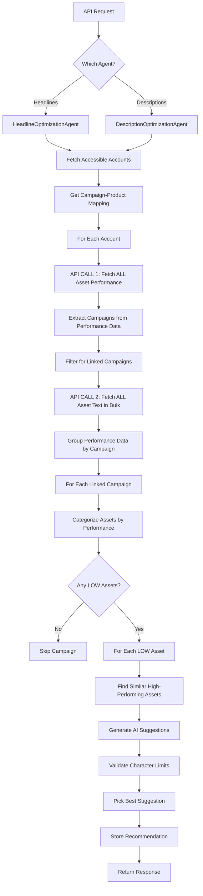

# Asset Optimization Service Documentation

## Overview

The Asset Optimization Service identifies low-performing ad assets (headlines and descriptions) in Google Ads campaigns and generates high-performing replacement suggestions using AI. The service is split into two specialized agents:

1. **Headline Optimization Agent**: Optimizes headline assets (max 30 characters)
2. **Description Optimization Agent**: Optimizes description assets (max 90 characters)

Both agents share **account-level bulk fetching** for optimal performance, utilizing shared core utilities for categorization, similarity matching, and validation.

---

## Architecture

### High-Level Components

```
Optimization Agents (Headline / Description)
├── GoogleAccountsAdapter (fetch accounts)
├── GoogleAssetsAdapter (bulk fetch performance & asset data)
├── CampaignMappingService (link campaigns to products)
├── core.optimization.AssetCategorizer (performance tier classification)
├── core.optimization.SimilarityMatcher (semantic similarity)
├── core.optimization.AssetValidator (character limit enforcement)
└── services (HeadlineGenerator / DescriptionGenerator)
```

### Optimized Workflow (Account-Level Fetching)



---

## Performance Optimization Strategy

### API Call Efficiency

The service uses **account-level bulk fetching** to minimize Google Ads API calls:

| Metric | Value |
|--------|-------|
| **API Calls per Account** | 2 (fixed) |
| **Reduction vs. Per-Campaign** | ~90% for accounts with 10+ campaigns |
| **Call 1** | `fetch_asset_performance(campaign_id=None)` - Returns ALL assets + metadata |
| **Call 2** | `fetch_asset_text(all_asset_ids)` - Returns asset text in bulk |

**Example:** For an account with 10 linked campaigns:
- **Before optimization:** 20 API calls (10 campaigns × 2 calls each)
- **After optimization:** 2 API calls (account-level bulk)
- **Savings:** 90% reduction

---

## API Reference

### Endpoints

| Method | Endpoint | Description |
|--------|----------|-------------|
| `POST` | `/api/ds/optimize/headlines` | Triggers headline optimization |
| `POST` | `/api/ds/optimize/descriptions` | Triggers description optimization |

### Headers

| Header | Type | Required | Description |
|--------|------|----------|-------------|
| `clientCode` | string | Yes | Client identifier for authentication and campaign mapping |

### Response Format

```json
{
  "status": "success",
  "data": {
    "recommendations": [
      {
        "platform": "GOOGLE",
        "parent_account_id": "1234567890",
        "account_id": "9876543210",
        "product_id": "prod_abc123",
        "campaign_id": "987654321",
        "campaign_name": "Winter Sale Campaign",
        "campaign_type": "SEARCH",
        "completed": false,
        "fields": {
          "headlines": [
            {
              "ad_group_id": "111",
              "ad_group_name": "Ad Group 1",
              "ad_id": "222",
              "ad_name": "Ad 1",
              "asset_id": "333",
              "text": "Old Headline",
              "recommendation": "REMOVE",
              "reason": "Performance: LOW (impressions: 100, clicks: 2)"
            },
            {
              "ad_group_id": "111",
              "ad_group_name": "Ad Group 1",
              "ad_id": "222",
              "ad_name": "Ad 1",
              "asset_id": null,
              "text": "New AI-Generated Headline",
              "recommendation": "ADD",
              "reason": "AI-generated replacement for low performer"
            }
          ]
        }
      }
    ]
  }
}
```

---

## Core Modules

### 1. Optimization Agents

**[headline_optimization_agent.py](file:///Users/sachinbalagam/DEV/Adzump-AI/agents/optimization/headline_optimization_agent.py)**
- Orchestrates headline optimization workflow
- Enforces 30-character limit
- Uses `HeadlineGenerator` for AI suggestions

**[description_optimization_agent.py](file:///Users/sachinbalagam/DEV/Adzump-AI/agents/optimization/description_optimization_agent.py)**
- Orchestrates description optimization workflow
- Enforces 90-character limit
- Uses `DescriptionGenerator` for AI suggestions

### 2. Google Ads Adapter

**[assets.py](file:///Users/sachinbalagam/DEV/Adzump-AI/adapters/google/optimization/assets.py)**

Key methods:
- `fetch_asset_performance(campaign_id=None)` - Account-level or campaign-level fetch
- `fetch_asset_text(asset_ids)` - Bulk text retrieval
- `fetch_all_campaigns()` - List enabled campaigns (deprecated for asset optimization)

### 3. Core Utilities

Located in `core/optimization/`:

**AssetCategorizer**
- Classifies assets into performance tiers:
  - **LOW**: Poor performance (targeted for replacement)
  - **GOOD/BEST**: High performers (used as inspiration)
  - **LEARNING/PENDING**: Insufficient data

**SimilarityMatcher**
- Uses OpenAI embeddings (`text-embedding-3-small`)
- Finds semantically similar high-performing assets
- Provides context to the LLM for better suggestions

**AssetValidator**
- Enforces strict character limits (30 for headlines, 90 for descriptions)
- Rejects invalid suggestions before storage

### 4. Generation Services

Located in `services/`:

**HeadlineGenerator**
- Prompt: `prompts/optimization/headline_optimization_prompt.txt`
- Model: `gpt-4o-mini` (temperature: 0.8)
- Generates 5 options, returns all validated suggestions

**DescriptionGenerator**
- Prompt: `prompts/optimization/description_optimization_prompt.txt`
- Model: `gpt-4o-mini` (temperature: 0.8)
- Generates 5 options, returns all validated suggestions

---

## Data Flow

### Step 1: Fetch Accounts and Mapping

```python
accounts = await accounts_adapter.fetch_accessible_accounts(client_code)
campaign_product_map = await campaign_mapping_service.get_campaign_product_mapping(client_code)
```

### Step 2: Process Each Account (2 API Calls)

```python
# API Call 1: Fetch ALL asset performance for the account
all_performance_data = await assets_adapter.fetch_asset_performance(
    customer_id=account_id,
    login_customer_id=parent_account_id,
    client_code=client_code,
    campaign_id=None  # Account-level!
)

# Extract campaigns from performance data
linked_campaigns = extract_linked_campaigns(all_performance_data, campaign_product_map)

# API Call 2: Fetch ALL asset text in one call
all_asset_details = await assets_adapter.fetch_asset_text(
    asset_ids=all_unique_asset_ids,
    customer_id=account_id,
    login_customer_id=parent_account_id,
    client_code=client_code
)
```

### Step 3: Process Each Linked Campaign

```python
# Categorize assets by performance tier
categorized = categorizer.categorize_assets(
    performance_data, 
    asset_details, 
    asset_type="HEADLINE"  # or "DESCRIPTION"
)

# For each LOW asset, generate replacement
for low_asset in categorized["low_assets"]:
    similar_assets = similarity_matcher.find_similar(low_asset, categorized["tier_1"])
    suggestion = await generator.generate(low_asset, similar_assets)
    validated = validator.validate(suggestion)
```

---

## Performance Tier Strategy

Assets are categorized into tiers, and high performers guide AI generation:

1. **Tier 1 (GOOD/BEST)**: Most similar assets from this tier are used as inspiration
2. **Tier 2 (LEARNING/PENDING)**: Used if Tier 1 is empty
3. **Campaign Context**: Fallback to keywords from campaign/ad group names
4. **General Best Practices**: Final fallback with Google Ads best practices

---

## Data Models

Located in [core/models/optimization.py](file:///Users/sachinbalagam/DEV/Adzump-AI/core/models/optimization.py)

### CampaignRecommendation

```python
class CampaignRecommendation(BaseModel):
    platform: str
    parent_account_id: str
    account_id: str
    product_id: str
    campaign_id: str
    campaign_name: str
    campaign_type: str
    completed: bool
    fields: OptimizationFields
```

### OptimizationFields

```python
class OptimizationFields(BaseModel):
    headlines: Optional[List[AssetFieldRecommendation]] = None
    descriptions: Optional[List[AssetFieldRecommendation]] = None
    age: Optional[List[AgeFieldRecommendation]] = None
    keywords: Optional[List[KeywordRecommendation]] = None
    # ... other optimization types
```

### AssetFieldRecommendation

Each recommendation contains:
- `ad_group_id` / `ad_group_name`
- `ad_id` / `ad_name`
- `asset_id` (null for ADD recommendations)
- `text`: The headline or description text
- `recommendation`: "ADD" or "REMOVE"
- `reason`: Performance metrics or generation context

---

## Storage Integration

Recommendations are stored via `RecommendationStorageService` into the `campaignSuggestions` collection (MongoDB). This allows:
- Asynchronous retrieval by the user
- Review before application
- Audit trail of suggestions

---

## Character Limits (Strict Enforcement)

| Asset Type | Limit |
|------------|-------|
| Headlines | 30 characters |
| Descriptions | 90 characters |

The `AssetValidator` **rejects** any suggestion exceeding these limits to ensure Google Ads API compatibility.

---

## Logging and Observability

The service uses `structlog` for structured logging:

- **Account hierarchy**: Logs MCC and account IDs
- **Campaign linking status**: Shows which campaigns are linked to products
- **Performance data volume**: Logs counts of assets fetched
- **Categorization results**: Shows distribution of LOW/GOOD/BEST assets
- **API call tracking**: Logs scope (account vs campaign) and result counts

Example log:
```
Fetched asset performance data for account | customer_id=123 | results_count=450
Campaign Linking Status: Winter Sale (987654321) | client_code=MODLI9 | is_linked=True
Headlines categorized | campaign_id=987654321 | low=2 | tier_1=8
```

---

## Error Handling

- **No accessible accounts**: Returns empty recommendations
- **No asset performance data**: Skips account
- **No linked campaigns**: Skips account
- **No LOW assets**: Skips campaign (no optimization needed)
- **LLM generation failure**: Logs error, skips asset
- **Validation failure**: Logs error, skips asset

All errors are logged with `structlog` for debugging.
