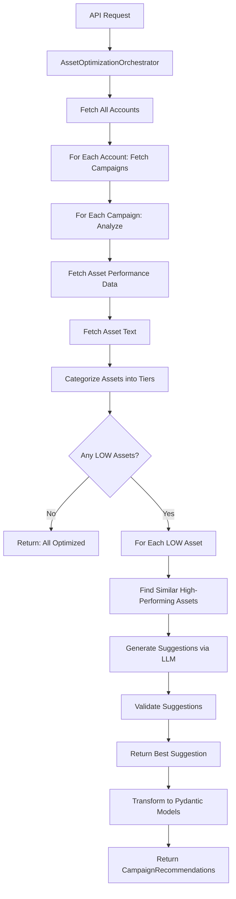

# Asset Optimization Service Documentation

## Overview

The Asset Optimization Service analyzes Google Ads campaigns to identify low-performing ad assets (headlines and descriptions) and provides AI-generated replacement suggestions. The service uses performance tiers, semantic similarity matching, and LLM-powered generation to ensure replacements maintain brand consistency while improving performance.

---

## Architecture

### Components

```
AssetOptimizationOrchestrator
├── GoogleAccountsAdapter (fetch accounts)
├── GoogleAssetsAdapter (fetch performance & asset data)
├── AssetCategorizer (tier classification)
├── SimilarityMatcher (semantic matching)
└── SuggestionGenerator (LLM-powered suggestions)
```

### Flow Diagram



---

## API Reference

### Endpoint

```
POST /api/ds/optimize/assets
```

### Headers

| Header | Type | Required | Description |
|--------|------|----------|-------------|
| `clientCode` | string | Yes | Client identifier (via auth_context) |

### Response Format

```json
{
  "status": "success",
  "data": {
    "recommendations": [
      {
        "platform": "google_ads",
        "parent_account_id": "1234567890",
        "account_id": "9876543210",
        "product_id": "prod_123",
        "campaign_id": "campaign_456",
        "campaign_name": "Spring Sale Campaign",
        "campaign_type": "SEARCH",
        "completed": false,
        "fields": {
          "assets": [
            {
              "ad_group_id": "789",
              "ad_group_name": "Shoes AdGroup",
              "ad_id": "1011",
              "ad_name": "Responsive Ad 1",
              "ad_group_ad_asset_resource_name": "customers/123/adGroupAdAssets/789~0~456",
              "asset_id": "456",
              "asset_type": "HEADLINE",
              "text": "Old Headline - Low Performance",
              "recommendation": "REMOVE",
              "reason": "LOW performance (50 impressions)",
              "applied": false
            },
            {
              "ad_group_id": "789",
              "ad_group_name": "Shoes AdGroup",
              "ad_id": "1011",
              "ad_name": "Responsive Ad 1",
              "ad_group_ad_asset_resource_name": "customers/123/adGroupAdAssets/789~0~0",
              "asset_id": null,
              "asset_type": "HEADLINE",
              "text": "Shop Premium Running Shoes",
              "recommendation": "ADD",
              "reason": "Replacement for LOW asset (generated from tier_1)",
              "applied": false
            }
          ]
        }
      }
    ]
  }
}
```

---

## Core Modules

### 1. AssetOptimizationOrchestrator

**File:** `agents/optimization/asset_optimization/orchestrator.py`

**Responsibilities:**
- Orchestrate the entire optimization workflow
- Fetch accounts and campaigns
- Coordinate component modules
- Transform results to Pydantic models
- Return standardized `OptimizationResponse`

**Key Methods:**

#### `analyze_all_campaigns(client_code: str) -> dict`

Analyzes all campaigns across all accessible accounts.

**Returns:** `{"recommendations": [CampaignRecommendation, ...]}`

#### `analyze_campaign(customer_id, campaign_id, login_customer_id, client_code) -> dict`

Analyzes a single campaign.

**Returns:**
```python
{
    "campaign_id": str,
    "campaign_name": str,
    "campaign_type": str,
    "total_low_assets": int,
    "total_suggestions": int,
    "suggestions": [...]
}
```

---

### 2. AssetCategorizer

**File:** `agents/optimization/asset_optimization/categorizer.py`

**Purpose:** Categorize assets into performance tiers based on Google's performance labels.

**Tiers:**
- **LOW**: Assets labeled `LOW` by Google → Need replacement
- **Tier 1**: Assets labeled `GOOD` or `BEST` → Best examples for generation
- **Tier 2**: Assets labeled `LEARNING` or `PENDING` → Secondary examples
- **Tier 3**: Other labels → Fallback examples

**Method:**
```python
def categorize_assets(performance_data: list, asset_details: dict) -> dict
```

**Returns:**
```python
{
    "low_assets": [...],   # Assets to replace
    "tier_1": [...],       # Best performing
    "tier_2": [...],       # Learning/Pending
    "tier_3": [...]        # Others
}
```

---

### 3. SimilarityMatcher

**File:** `agents/optimization/asset_optimization/similarity_matcher.py`

**Purpose:** Find semantically similar high-performing assets to guide replacement generation.

**Strategy:**
1. **Tier 1 First**: Try to find similar assets in `GOOD/BEST` tier
2. **Tier 2 Fallback**: Use `LEARNING/PENDING` if tier 1 empty
3. **Tier 3 Fallback**: Use other assets if both above empty
4. **Campaign Context**: Extract keywords from campaign/ad group names
5. **General Best Practices**: Last resort if no examples available

**Key Method:**
```python
async def find_similar_assets(
    low_asset_text: str,
    categorized_assets: dict,
    asset_type: str,
    campaign_name: str,
    ad_group_name: str
) -> Tuple[list, str]
```

**Returns:**
- `(similar_assets, source_tier)` where:
  - `similar_assets`: Top 3 most similar assets (by embedding cosine similarity)
  - `source_tier`: One of `"tier_1"`, `"tier_2"`, `"tier_3"`, `"campaign_context"`, `"general_best_practices"`

**Example:**
```python
similar_assets = [
    {
        "asset": {
            "text": "Shop Premium Running Shoes",
            "label": "BEST",
            "impressions": 5000
        },
        "similarity": 0.87
    },
    ...
]
source_tier = "tier_1"
```

---

### 4. SuggestionGenerator

**File:** `agents/optimization/asset_optimization/suggestion_generator.py`

**Purpose:** Generate and validate asset replacement suggestions using LLM.

**Methods:**

#### `generate_suggestions(...) -> list`

Generates 5 raw suggestions via LLM (GPT-4o-mini at temperature 0.8).

**Prompt Strategy:**
- **With Examples**: Learn from tier 1/2/3 similar assets
- **Campaign Context**: Use keywords from campaign/ad group names
- **General**: Follow Google Ads best practices

**Returns:** List of raw text suggestions

#### `validate_suggestions(suggestions: list, asset_type: str) -> list`

Validates suggestions against Google Ads constraints:
- **Headlines**: Max 30 characters
- **Descriptions**: Max 90 characters
- **Deduplication**: Remove exact duplicates (case-insensitive)

**Returns:**
```python
[
    {"text": "Shop Premium Running Shoes", "character_count": 27},
    {"text": "Best Deals on Running Gear", "character_count": 28},
    ...
]
```

> **Note:** Orchestrator selects only the **best 1** suggestion for strict 1:1 replacement.

---

## Performance Tier System

### Google Ads Performance Labels

| Label | Meaning | Usage in Service |
|-------|---------|------------------|
| `LOW` | Underperforming | **Target for replacement** |
| `GOOD` | Above average | **Tier 1**: Best examples for generation |
| `BEST` | Top performing | **Tier 1**: Best examples for generation |
| `LEARNING` | Gathering data | **Tier 2**: Secondary examples |
| `PENDING` | Not enough data | **Tier 2**: Secondary examples |
| `UNKNOWN` | No label assigned | **Tier 3**: Fallback examples |

### Fallback Strategy

```
1. Find similar in Tier 1 (GOOD/BEST)
   ↓ (if empty)
2. Find similar in Tier 2 (LEARNING/PENDING)
   ↓ (if empty)
3. Find similar in Tier 3 (Others)
   ↓ (if empty)
4. Use campaign/ad group keywords
   ↓ (if no keywords)
5. Use general best practices
```

---

## Replacement Strategy

### 1:1 Replacement

For each LOW asset, the service:
1. Generates **5 candidate suggestions** via LLM
2. Validates all 5 (length, deduplication)
3. Selects **only the BEST 1** validated suggestion
4. Returns 2 recommendations:
   - `REMOVE` the LOW asset
   - `ADD` the best replacement

### Example Output

For 1 LOW headline:
```json
[
  {
    "asset_type": "HEADLINE",
    "text": "Old Headline",
    "recommendation": "REMOVE",
    "reason": "LOW performance (50 impressions)"
  },
  {
    "asset_type": "HEADLINE",
    "text": "Shop Premium Running Shoes",
    "recommendation": "ADD",
    "reason": "Replacement for LOW asset (generated from tier_1)"
  }
]
```

---

## Error Handling

### Campaign-Level Failures

If a single campaign fails, the service:
- ✅ Logs the error
- ✅ Continues processing other campaigns
- ✅ Returns error status in results

```python
{
    "customer_id": "123",
    "campaign_id": "456",
    "campaign_name": "Failed Campaign",
    "status": "error",
    "error": "Failed to fetch asset performance: API timeout"
}
```

### Account-Level Failures

If an entire account fails:
- ✅ Logs the error
- ✅ Continues processing other accounts

### Graceful Degradation

- **No LOW assets**: Returns success with message "All assets performing well"
- **No examples available**: Uses campaign context or general best practices
- **Validation fails**: Logs warning, continues with next asset

---

## Data Models

### CampaignRecommendation

```python
class CampaignRecommendation(BaseModel):
    platform: str                    # "google_ads"
    parent_account_id: str           # loginCustomerId (MCC)
    account_id: str                  # customerId
    product_id: str                  # Your product (website) ID
    campaign_id: str
    campaign_name: str
    campaign_type: str               # "SEARCH", "DISPLAY", etc.
    completed: bool = False
    fields: OptimizationFields
```

### OptimizationFields

```python
class OptimizationFields(BaseModel):
    assets: Optional[List[AssetFieldRecommendation]] = None
    # Future: age, keywords, negativeKeywords, etc.
```

### AssetFieldRecommendation

```python
class AssetFieldRecommendation(BaseModel):
    ad_group_id: str
    ad_group_name: str
    ad_id: str
    ad_name: str
    ad_group_ad_asset_resource_name: str
    asset_id: Optional[str] = None   # None for "ADD" recommendations
    asset_type: Literal["HEADLINE", "DESCRIPTION"]
    text: str
    recommendation: Literal["ADD", "REMOVE"]
    reason: str
    applied: bool = False
```

---

## Usage Examples

### Example 1: Basic Request

```bash
curl -X POST https://api.adzump.ai/api/ds/optimize/assets \
  -H "clientCode: client_abc123"
```

### Example 2: Processing Response

```python
response = await client.post("/api/ds/optimize/assets")
data = response.json()["data"]

for campaign_rec in data["recommendations"]:
    campaign_id = campaign_rec["campaign_id"]
    assets = campaign_rec["fields"]["assets"]
    
    removals = [a for a in assets if a["recommendation"] == "REMOVE"]
    additions = [a for a in assets if a["recommendation"] == "ADD"]
    
    print(f"Campaign {campaign_id}:")
    print(f"  - Remove {len(removals)} low-performing assets")
    print(f"  - Add {len(additions)} optimized replacements")
```

### Example 3: No Optimizations Needed

```json
{
  "status": "success",
  "data": {
    "recommendations": []
  }
}
```

This means all campaigns have well-performing assets.

---

## Configuration

### LLM Settings

- **Model**: `gpt-4o-mini`
- **Temperature**: `0.8` (creative but controlled)
- **Suggestions per LOW asset**: 5 (pick best 1)

### Character Limits

- **Headlines**: 30 characters (Google Ads limit)
- **Descriptions**: 90 characters (Google Ads limit)

### Similarity Matching

- **Top N similar**: 3 assets
- **Method**: Cosine similarity on OpenAI embeddings
- **Embedding Model**: `text-embedding-ada-002`

---

## Logging

The service uses structured logging (structlog) with detailed event tracking:

```json
{
  "event": "Campaign analysis succeeded",
  "customer_id": "5889758158",
  "campaign_id": "23492940418",
  "suggestions_count": 4,
  "logger": "agents.optimization.asset_optimization.orchestrator",
  "level": "info",
  "timestamp": "2026-02-09T06:18:18.634672Z"
}
```

### Key Log Events

- `bulk_analysis_start`: Started processing all accounts
- `accounts_fetched`: Fetched accessible accounts
- `fetch_performance`: Fetching asset performance data
- `categorize_assets`: Categorizing into tiers
- `process_low_asset`: Processing individual LOW asset
- `generate_suggestions`: Generating LLM suggestions
- `validate_suggestions`: Validating generated suggestions
- `bulk_analysis_complete`: Completed all processing

---

## Future Enhancements

### Planned Features

1. **Caching**: Cache recommendations for 24 hours to reduce API calls
2. **Batch Application**: Apply recommendations directly via Google Ads API
3. **Performance Tracking**: Track improvement metrics after applying recommendations
4. **Multi-Platform**: Extend to Meta Ads, TikTok Ads
5. **Custom Rules**: Allow clients to define custom replacement rules
6. **A/B Testing**: Test new assets in parallel with old ones

### Data Enrichment

Currently, the service uses placeholder values for:
- `ad_group_ad_asset_resource_name` (constructed, not fetched)
- `ad_id` and `ad_name` (extracted from performance data)

**TODO**: Fetch these fields directly from Google Ads API for complete accuracy.
