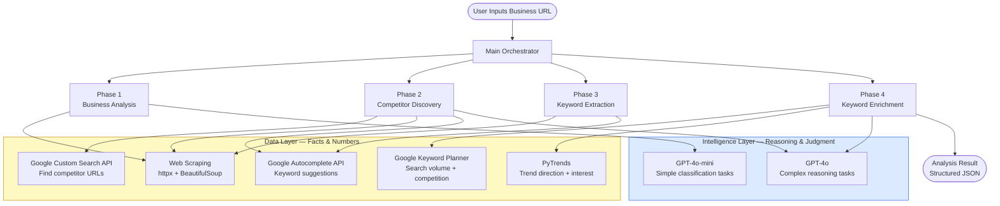
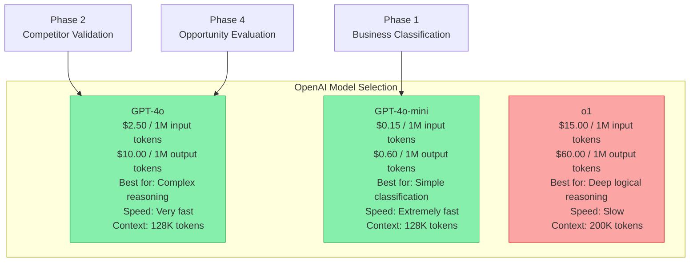
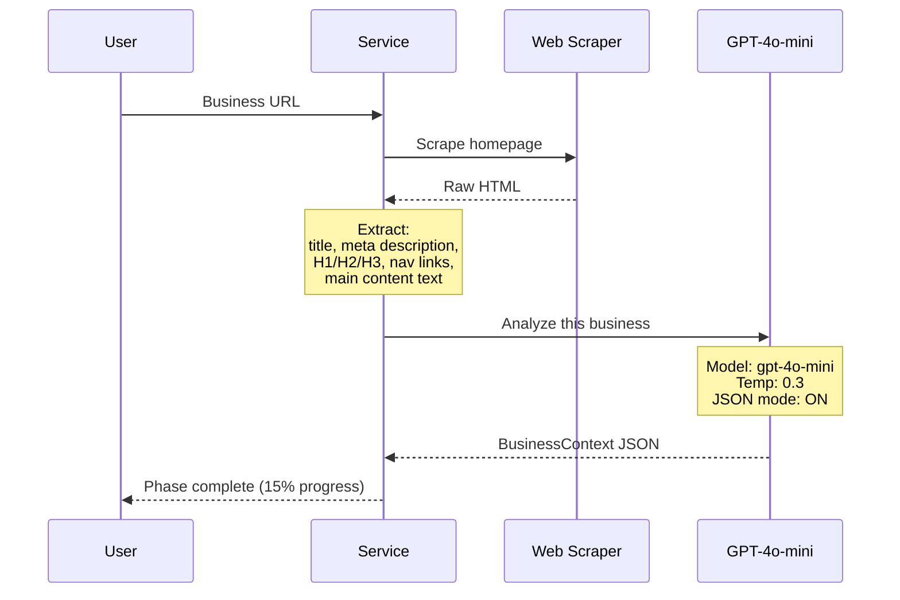
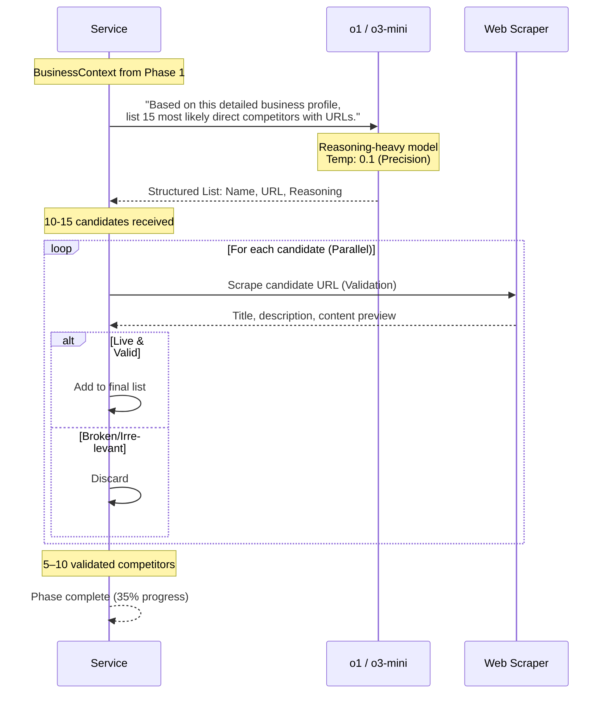
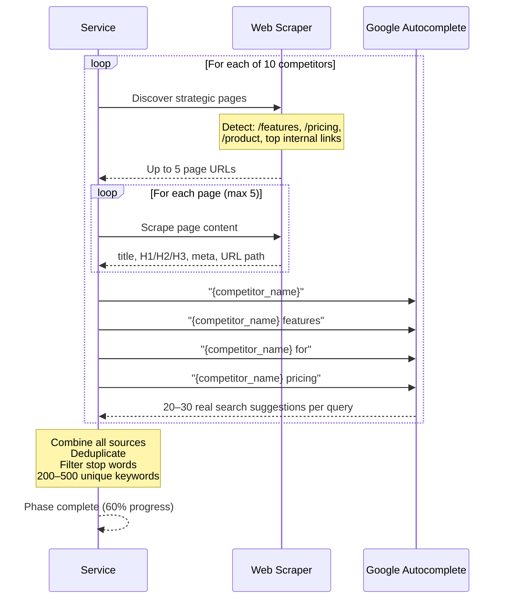
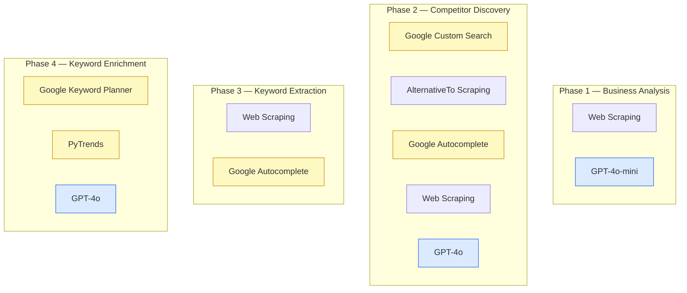

# Competitor Analysis Service — Complete Architecture

**Status:** Phase 1–4 Complete — Phase 5–6 Pending
**Team Stack:** Python · FastAPI · OpenAI API · Google APIs · PostgreSQL · Redis

---

## Table of Contents

1. [Executive Summary](#1-executive-summary)
2. [System Architecture Overview](#2-system-architecture-overview)
3. [The Core Principle — Data vs Intelligence](#3-the-core-principle--data-vs-intelligence)
4. [Intelligence Layer — Model Selection](#4-intelligence-layer--model-selection)
5. [Phase 1 — Business Analysis](#5-phase-1--business-analysis)
6. [Phase 2 — Competitor Discovery](#6-phase-2--competitor-discovery)
7. [Phase 3 — Keyword Extraction](#7-phase-3--keyword-extraction)
8. [Phase 4 — Keyword Enrichment](#8-phase-4--keyword-enrichment)
9. [Future Roadmap (Deferred Phases)](#9-future-roadmap-deferred-phases)
10. [API Usage Map](#10-api-usage-map)
11. [Cost Analysis](#11-cost-analysis)
12. [Scalability Strategy](#12-scalability-strategy)
13. [Configuration Strategy](#13-configuration-strategy)
14. [Key Design Decisions](#14-key-design-decisions)

---

## 1. Executive Summary

### What This Service Does

Takes a **single business URL** as input and returns a complete competitor analysis including validated competitors, keyword opportunities with strategic reasoning, and a "Why You Lose" analysis — all powered by AI.

### Input → Output

```
INPUT:  https://yourapp.com

OUTPUT:
   5-10 validated direct competitors (with URLs)
   50+ keyword opportunities with AI scoring and reasoning
   "Why You Lose" analysis for top 10 keywords
   Prioritised action plan with effort estimates
   Exportable report (JSON + Markdown + CSV)
```

### Key Differentiator

Traditional tools (Ahrefs, SEMrush) show you **data**. This service provides **intelligence** — it explains why competitors rank better and tells you exactly what to do about it, using AI reasoning rather than rigid formulas.

### How This Service Is Different

There are two categories of existing tools. This service occupies a **third, unique position**:

#### Category 1 — Data-Heavy Tools (Ahrefs, SEMrush, SpyFu)

These companies crawl **billions of pages** with their own infrastructure and maintain massive keyword databases built over 10+ years. When a user queries them, they do a **database lookup** — no real-time analysis.

| What They Do Well                   | What They Don't Do                          |
| ----------------------------------- | ------------------------------------------- |
| Backlink profiles, domain authority | Don't tell you **why** you're losing        |
| SERP position history               | Don't provide **strategic reasoning**       |
| Massive keyword databases           | Don't give you an **action plan**           |
| Instant results (pre-indexed)       | User must **interpret the data themselves** |

#### Category 2 — AI-First Content Tools (Surfer SEO, Clearscope, Frase)

These tools scrape **Google SERPs in real-time** for a keyword, then use NLP/AI to analyse the top-ranking pages and tell users how to optimise their content.

| What They Do Well            | What They Don't Do                                         |
| ---------------------------- | ---------------------------------------------------------- |
| Real-time SERP analysis      | User must **already know their keywords**                  |
| Content scoring (A+ to F)    | **No competitor discovery** — user provides the keyword    |
| "Use these 50 terms to rank" | Don't explain **why competitors win** at a strategic level |
| NLP-powered content grading  | Don't provide **business-level competitor analysis**       |

#### Category 3 — This Service (AI-Powered Competitor Intelligence)

This service takes a **single URL** and does everything — discovers competitors, finds keywords, explains why you lose, and builds an action plan. No prior keyword knowledge required.

| Capability                  | Ahrefs/SEMrush    | Surfer/Clearscope/Frase | **This Service**                            |
| --------------------------- | ----------------- | ----------------------- | ------------------------------------------- |
| **Input required**          | Keywords / domain | Keywords                | **Just a URL**                              |
| **Competitor discovery**    | Manual lookup     | Not available           | **Automated from URL**                      |
| **Keyword research**        | Database lookup   | User-provided           | **Auto-discovered from competitors**        |
| **Trend data**              | Limited           | Not included            | **PyTrends built-in**                       |
| **"Why you lose" analysis** | Raw metrics only  | Partial (content-level) | **GPT-4o strategic reasoning**              |
| **Action plan**             | User interprets   | "Add these terms"       | **"Build this page, here's the structure"** |
| **Backlink data**           | Deep              | None                    | Via DataForSEO (post-MVP)                   |
| **SERP positions**          | Historical        | Real-time               | Via SerpApi (post-MVP)                      |
| **Infrastructure cost**     | $10M+             | Moderate                | **Near-zero**                               |

#### The One-Line Pitch

> **Ahrefs shows you the scoreboard. Surfer tells you what words to use. This service tells you why you're losing and exactly what to do about it — starting from just a URL.**

### Processing Time

| Tier | Method          | Time         |
| ---- | --------------- | ------------ |
| Free | Queued (Celery) | 5–10 minutes |
| Paid | Real-time       | 2–3 minutes  |

---

## 2. System Architecture Overview

### High-Level Flow



### Why This Separation Matters

```
Google APIs  →  Provide FACTS (URLs, volumes, trends, suggestions)
Claude/GPT   →  Provide REASONING (Is this a competitor? Is this a good opportunity? Why do they rank better?)

Data APIs cannot reason. AI cannot search the web or know search volumes.
They are complementary — not substitutes.
```

---

## 3. The Core Principle — Data vs Intelligence


### Data vs Intelligence: Side-by-Side Examples

#### Example 1 — Competitor Validation

**Without Intelligence (Hardcoded Rules):**

```
if 'pricing' in url:  score += 30
if 'features' in url: score += 20
if score >= 60:       is_competitor = True

Problem: Fails on media sites, review blogs, adjacent tools
Problem: No reasoning provided — user can't verify the decision
```

**With Intelligence (GPT-4o):**

```
Prompt: "Is this a direct competitor given our business context?"

Response:
{
  "is_competitor": true,
  "confidence": 0.95,
  "reasoning": "Direct competitor — both target remote teams with
                project management. Similar pricing model ($12-15/user/month),
                same ICP (distributed teams 10-50 people), overlapping features."
}

Benefit: Handles edge cases, explains the decision, context-aware
```

#### Example 2 — Opportunity Scoring

**Without Intelligence (Formula):**

```
score = (volume / 10000) * 40 + competition_score * 30 + trend_score * 20
Returns: 75
User: "Why 75? What does that mean for me?"
```

**With Intelligence (GPT-4o):**

```
Returns:
{
  "opportunity_score": 72,
  "strategic_fit": "medium",
  "reasoning": "While volume is attractive (12K/month), this generic term is
                dominated by Asana, Monday, Trello with DR 80+. For a small team,
                better ROI comes from 'project management for remote teams'
                which has 8.5K volume, aligns with your async-first positioning,
                and faces realistic competition.",
  "recommended_action": "Skip this generic term. Target the long-tail variation instead."
}

User: "That makes sense. I'll focus on the long-tail version."
```

---

## 4. Intelligence Layer — Model Selection

### Model Overview



### Model Selection Rationale

| Phase       | Task                    | Model         | Why This Model                                                                                            |
| ----------- | ----------------------- | ------------- | --------------------------------------------------------------------------------------------------------- |
| **Phase 1** | Business classification | `gpt-4o-mini` | Simple extraction task. Clear structure. 15x cheaper than GPT-4o. Fast.                                   |
| **Phase 2** | Competitor validation   | `gpt-4o`      | Needs nuanced judgment. Must distinguish products vs media vs review sites. Mini misses edge cases.       |
| **Phase 4** | Opportunity evaluation  | `gpt-4o`      | Multi-factor reasoning. Must weigh trade-offs and consider business context. Strategic thinking required. |

### Why Not o1?

```
o1 is 6x more expensive than GPT-4o and significantly slower.
The reasoning tasks in our service (classification, validation, evaluation)
do not require the mathematical depth o1 provides.

GPT-4o handles strategic reasoning, nuanced judgment, and
content analysis with excellent quality at a fraction of the cost.

Upgrade path: If gap analysis quality becomes critical for enterprise
customers, switch Phase 5 to o1-mini ($3/1M) as a targeted upgrade.
```

### Model Configuration

```python
# config/settings.py — model configuration only
# No business logic, no thresholds, no formulas

class ModelConfig:
    # Task → Model mapping
    BUSINESS_CLASSIFICATION  = "gpt-4o-mini"   # Simple extraction
    COMPETITOR_VALIDATION    = "gpt-4o"         # Nuanced judgment
    OPPORTUNITY_EVALUATION   = "gpt-4o"         # Strategic reasoning
    GAP_ANALYSIS             = "gpt-4o"         # Deep content analysis

    # Temperature — how deterministic the output should be
    TEMPERATURE = {
        "classification":  0.3,  # High consistency needed
        "validation":      0.5,  # Balanced
        "evaluation":      0.6,  # Allows strategic nuance
        "gap_analysis":    0.5,  # Balanced, specific
    }

    # Max tokens per response
    MAX_TOKENS = {
        "classification":  1000,
        "validation":      500,
        "evaluation":      800,
        "gap_analysis":    1500,
    }
```

---

## 5. Phase 1 — Business Analysis

**Goal:** Understand what the business does, who it serves, and what keywords it currently targets.

### Flow



### Data Sources

| Source       | Tech                  | What It Provides                            |
| ------------ | --------------------- | ------------------------------------------- |
| Web Scraping | httpx + BeautifulSoup | Homepage HTML, meta tags, headings, content |

### Intelligence Applied — GPT-4o-mini

```
System: "You are a business analyst. Classify businesses accurately from their website content."

User:
"Analyze this business:

Title: {title}
Meta Description: {meta_description}
H1 Tags: {h1_tags}
Main Content Preview: {content[:600]}
Navigation Links: {nav_links}

Provide:
1. business_name
2. industry (be specific — e.g., 'Project Management SaaS for remote teams', not just 'SaaS')
3. target_audience (who they serve)
4. primary_keywords (what they are already targeting)
5. value_proposition (their core claim)
6. business_model (SaaS / marketplace / service / other)

JSON format."
```

### Output — BusinessContext

```json
{
  "domain": "yourapp.com",
  "business_name": "YourApp",
  "industry": "Project Management SaaS for remote teams",
  "target_audience": "Distributed teams of 10–50 people",
  "primary_keywords": [
    "project management",
    "remote team collaboration",
    "async project tracking"
  ],
  "value_proposition": "Async-first project management for distributed teams",
  "business_model": "SaaS (subscription)"
}
```

---

## 6. Phase 2 — Competitor Discovery (Pure AI Discovery)

**Goal:** Identify a high-confidence list of 5–10 direct competitors using the world's most powerful reasoning models (e.g., `o1` or `o3-mini`) fed with rich context from Phase 1.

> [!TIP]
> **Single-Call Discovery:** By providing the LLM with the deep business analysis from Phase 1, we can get a highly accurate competitor list in a single "reasoning" call, bypassing the need for noisy keyword searches for the majority of businesses.

### Discovery & Validation Flow



### Data Sources

| Source             | Tech         | Why We Use It                                                                                 |
| :----------------- | :----------- | :-------------------------------------------------------------------------------------------- |
| **Reasoning LLM**  | o1 / o3-mini | Direct identification of competitors by reasoning over the user's business context.           |
| **ScraperService** | Playwright   | Crucial validation layer to ensure the AI-suggested competitors are real, live, and relevant. |

### Handling AI Staleness & Hallucination

Even the best LLMs can occasionally provide outdated URLs or miss a brand-new startup. We mitigate this by:

1.  **Auto-Validation:** The service immediately scrapes every URL provided by the AI. If the URL returns a 404 or the content doesn't match the industry, it is filtered out.
2.  **Phase 1 Context:** We don't just ask "who are my competitors?". we provide the **BusinessContext** (Phase 1 output) which includes the specific value prop and target audience, forcing the AI to be precise.

### Intelligence Applied — Reasoning LLM (o1/o3-mini)

```
System: "You are a market intelligence researcher with access to a vast database of SaaS and B2B software."

User:
"Identify the top 15 direct competitors for the business described below.

BUSINESS CONTEXT:
Name: {business_name}
Industry: {industry}
Target Audience: {target_audience}
Value Prop: {value_proposition}

For each competitor, provide:
1. company_name
2. homepage_url (must be the main product site)
3. competitor_type (Direct / Adjacent)
4. reasoning: Why specifically do they compete for this ICP?

Output valid JSON list."
```

### Output — Validated Competitors

```json
{
  "total_candidates": 15,
  "validated_competitors": 8,
  "competitors": [
    {
      "url": "https://monday.com",
      "name": "Monday.com",
      "is_competitor": true,
      "confidence": 0.98,
      "reasoning": "Direct SaaS competitor with identical target audience and overlapping feature set."
    }
  ]
}
```

---

## 7. Phase 3 — Keyword Extraction

**Goal:** Extract 200–500 keywords that validated competitors are actively targeting.

### Flow



### Data Sources

| Source                 | What Is Extracted         | Keywords Per Competitor |
| ---------------------- | ------------------------- | ----------------------- |
| Page Title (`<title>`) | Core positioning keywords | 3–5                     |
| Meta Description       | Supporting keywords       | 5–8                     |
| H1 Headings            | Primary keyword targets   | 2–4                     |
| H2/H3 Headings         | Topic coverage            | 8–15                    |
| URL Path Segments      | Feature/category keywords | 3–6                     |
| Google Autocomplete    | Real user search queries  | 20–30                   |

### Multi-Page Crawl Strategy


**Why 5 pages max?** Homepage alone misses 30–40% of competitor keywords. Feature and pricing pages reveal the specific use cases and customer segments they're targeting.

### No Intelligence in Phase 3

Phase 3 is **pure data collection**. No AI calls are made here.
Keywords are raw material — intelligence is applied in Phase 4 where we evaluate them.

### Output

```json
{
  "total_extracted": 347,
  "unique_after_dedup": 198,
  "keywords_by_source": {
    "monday.com": {
      "pages_scraped": 5,
      "keywords": [
        {
          "keyword": "project management software",
          "source": "title",
          "page": "/"
        },
        {
          "keyword": "remote team collaboration",
          "source": "heading_h1",
          "page": "/features"
        },
        { "keyword": "monday.com for remote teams", "source": "autocomplete" }
      ]
    }
  }
}
```

---

## 8. Phase 4 — Keyword Enrichment

**Goal:** Add search metrics to every keyword, then use AI to evaluate which are genuine opportunities.

### Flow


### Data Sources

| API                    | What It Returns                                                                            | Rate Limit                               |
| ---------------------- | ------------------------------------------------------------------------------------------ | ---------------------------------------- |
| Google Keyword Planner | Monthly search volume, competition level (LOW/MEDIUM/HIGH), competition index (0–1)        | Unlimited (free Google Ads account)      |
| PyTrends               | Interest over 12 months, trend direction (rising/stable/declining), trend slope (% change) | Unlimited with 2s delay between requests |

### PyTrends — How It Helps

```
WITHOUT PyTrends:
  "project management software" — 12,000/month, MEDIUM
  "remote project management"   — 12,000/month, MEDIUM
  → They look identical

WITH PyTrends:
  "project management software" — DECLINING (-8%) → avoid
  "remote project management"   — RISING (+35%)   → target this!

PyTrends turns identical-looking keywords into clearly differentiated opportunities.
```

### Intelligence Applied — GPT-4o

```
System: "You are a strategic SEO advisor. Evaluate keyword opportunities
         considering business context, realistic resource constraints,
         and competitive landscape. Provide specific, actionable recommendations."

User:
"Evaluate this keyword opportunity:

KEYWORD: {keyword}

METRICS:
- Search Volume: {volume}/month
- Competition: {competition}
- Trend: {trend_direction} ({trend_slope:+.1f}%)
- Ranking Competitors: {competitor_count}

BUSINESS CONTEXT:
- Industry: {industry}
- Target Audience: {audience}
- Current Keywords: {current_keywords}
- Business Size: Small team, limited budget

Provide:
1. opportunity_score (0–100) with detailed reasoning
2. strategic_fit — high / medium / low
3. difficulty — easy / medium / hard
4. time_to_rank — realistic estimate
5. reasoning — why this is or isn't a good opportunity
6. recommended_action — specific next step

JSON format."
```

### Output — Enriched Keywords

```json
{
  "total_enriched": 50,
  "keywords": [
    {
      "keyword": "project management for remote teams",
      "search_volume": 8500,
      "competition": "MEDIUM",
      "competition_index": 0.45,
      "trend_direction": "rising",
      "trend_slope": 25.7,
      "ranking_competitors": 5,

      "opportunity_score": 87,
      "strategic_fit": "high",
      "difficulty": "medium",
      "time_to_rank": "3–4 months",
      "reasoning": "Excellent fit with your async-first positioning. Rising trend (+25.7%) aligns with remote work growth. Medium competition is realistic. Volume (8.5K) is meaningful without being dominated by giants.",
      "recommended_action": "CREATE: Dedicated /remote-teams landing page + 3 supporting blog posts. Timeline: 3–4 months to page 1."
    },
    {
      "keyword": "free project management tool",
      "search_volume": 15000,
      "competition": "HIGH",
      "trend_direction": "stable",
      "trend_slope": 0.8,

      "opportunity_score": 41,
      "strategic_fit": "low",
      "difficulty": "hard",
      "time_to_rank": "12+ months",
      "reasoning": "High volume but poor strategic fit. 'Free' intent signals low purchase intent — these users won't convert to your paid plans. Dominated by Trello, Asana free tier with DR 80+. Not winnable.",
      "recommended_action": "SKIP: Redirect effort to keywords matching your paid ICP."
    }
  ]
}
```

---

## 9. Future Roadmap (Deferred Phases)

The current implementation focuses on deep keyword intelligence and competitor profiling. The following phases are designed but pending implementation.

### Phase 5 — Gap Analysis

Comparing user landing pages directly against top-ranking competitor pages using GPT-4o to identify specific content and structural "Whys" behind ranking differences.

### Phase 6 — Formal Report Generation

Aggregation of all analysis data into downloadable Markdown, PDF, and CSV formats.

---

## 10. API Usage Map



### API Summary Table

| API                            | Phase   | Purpose                                    | Free Limit               | Can AI Replace?                    |
| ------------------------------ | ------- | ------------------------------------------ | ------------------------ | ---------------------------------- |
| **Web Scraping** (httpx + BS4) | 1, 2, 3 | Extract page content                       | Unlimited (rate limited) | Need real content                  |
| **Google Custom Search**       | 2       | Find competitor URLs                       | 100 queries/day          | AI can't search web                |
| **Google Autocomplete**        | 2, 3    | Real search suggestions, "X vs Y" patterns | Unlimited                | AI doesn't know what people search |
| **Google Keyword Planner**     | 4       | Monthly volume + competition               | Unlimited\*              | AI doesn't have this data          |
| **PyTrends**                   | 4       | Trend direction + slope over 12 months     | Unlimited (2s delay)     | AI doesn't have real-time data     |
| **GPT-4o-mini**                | 1       | Business classification                    | Pay per token            | —                                  |
| **GPT-4o**                     | 2, 4    | Competitor validation, opportunity scoring | Pay per token            | —                                  |

\*Requires a free Google Ads account (no spend required)

---

## 11. Cost Analysis

### Cost Per Full Analysis

```
Phase 1 — Business Classification (GPT-4o-mini)
  1 API call × ~2,000 input tokens × $0.15/1M = $0.0003

Phase 2 — Competitor Validation (GPT-4o)
  10 competitors × ~3,000 input tokens × $2.50/1M = $0.075

Phase 4 — Opportunity Evaluation (GPT-4o)
  50 keywords × ~2,000 input tokens × $2.50/1M = $0.25

──────────────────────────────────────────────
Input cost total:   ~$0.33
Output cost total:  ~$0.15 (estimated)
──────────────────────────────────────────────
TOTAL PER ANALYSIS: ~$0.48
```

### SaaS Pricing Tiers

| Tier     | Price/Month | Analyses | API Cost | Gross Margin |
| -------- | ----------- | -------- | -------- | ------------ |
| Free     | $0          | 1        | $0.48    | —            |
| Starter  | $29         | 5        | $2.40    | $26.60 (92%) |
| Pro      | $99         | 20       | $9.60    | $89.40 (90%) |
| Business | $299        | 100      | $48.00   | $251 (84%)   |

**Margins are excellent even with premium AI models.**

### Rate Limit Bottlenecks

| API                  | Free Limit  | Analyses/Month | Solution at Scale                      |
| -------------------- | ----------- | -------------- | -------------------------------------- |
| Google Custom Search | 100/day     | ~10/day        | Upgrade to paid ($5/1,000 queries)     |
| SerpAPI (optional)   | 100/month   | ~20/month      | Paid tier ($50/month = 5,000 searches) |
| PyTrends             | Unlimited   | Unlimited      | 2s delay between requests              |
| Google KP            | Unlimited   | Unlimited      | —                                      |
| GPT-4o               | Pay per use | Unlimited      | Monitor spend                          |

---

## 12. Scalability Strategy

### The Three Phases of Scale


### Caching Strategy

```
WHY CACHING IS YOUR COMPETITIVE MOAT:

If 100 customers all analyse "monday.com" as a competitor:
  - Without caching: 100 × full scrape + AI analysis = 100 × $0.48 cost
  - With shared cache: 1 × full analysis, then 99 × cache hit = ~$0.48 total

The more customers you have, the MORE efficient the system becomes.
This is the opposite of most systems — scale makes it cheaper, not more expensive.

Cache TTLs:
  - Competitor keywords:  30 days (competitor sites don't change often)
  - Keyword metrics:      30 days (volume/competition stable)
  - Full reports:          7 days  (fresh per user)
  - Industry classification: 24 hours
```

---

## 13. Configuration Strategy

### What Belongs in Configuration


### Minimal Configuration File

```yaml
# config/settings.yaml
# System constraints only — NO business logic, NO scoring formulas

rate_limits:
  google_cse_daily: 100
  pytrends_delay_seconds: 2.0
  scraping_delay_seconds: 2.0
  max_concurrent_scrapes: 5

analysis:
  max_competitors: 10
  max_pages_per_competitor: 5
  max_keywords_to_enrich: 50
  timeout_per_phase_seconds: 300

apis:
  openai:
    model_classification: "gpt-4o-mini"
    model_reasoning: "gpt-4o"
    max_tokens_classification: 1000
    max_tokens_reasoning: 1500

  google_cse:
    api_key: ${GOOGLE_CSE_API_KEY}
    engine_id: ${GOOGLE_CSE_ENGINE_ID}

  google_ads:
    developer_token: ${GOOGLE_ADS_DEVELOPER_TOKEN}

features:
  enable_gap_analysis: true
  enable_multi_page_crawl: true
  enable_caching: true
  enable_serp_positions: false # Phase 2 feature
```

**Why so minimal?**
Business logic — scoring, thresholds, what makes a good opportunity — lives in the **intelligence layer (GPT-4o)**. The AI makes the judgments. Configuration only controls system behaviour.

---

## 14. Key Design Decisions

| Decision                   | What We Chose                                        | Alternative Considered                             | Rationale                                                              |
| -------------------------- | ---------------------------------------------------- | -------------------------------------------------- | ---------------------------------------------------------------------- |
| **Intelligence model**     | GPT-4o for reasoning, GPT-4o-mini for classification | o1 for everything                                  | o1 is 6x more expensive with no benefit for our task types             |
| **Phase 2 approach (MVP)** | Hybrid: GPT-4o + Autocomplete                        | Full 3-source (CSE + AlternativeTo + Autocomplete) | Simpler, fewer failure points, comparable accuracy for most businesses |
| **Competitor validation**  | GPT-4o with business context                         | Hardcoded scoring rules                            | Rules fail on edge cases. AI handles nuance, provides reasoning        |
| **Opportunity scoring**    | GPT-4o with business context                         | Fixed mathematical formula                         | Context-aware scoring is far more valuable than a generic formula      |
| **SERP data**              | Skip for MVP, add SerpApi in v1.1                    | DIY scraping / include day 1                       | DIY is unreliable, SerpApi adds cost. Core product works without it    |
| **Configuration**          | System constraints only                              | Heavy config for business logic                    | Business logic belongs in the intelligence layer, not config files     |
| **Caching**                | Post-MVP (file-based for now)                        | Redis from day 1                                   | Premature complexity. Add when user count warrants it                  |

---

## Appendix — Success Metrics

| Metric                         | What It Tells You                                          | Target  |
| ------------------------------ | ---------------------------------------------------------- | ------- |
| Competitor validation accuracy | % of AI-discovered competitors that are genuinely relevant | > 90%   |
| Keyword discovery value        | % of discovered keywords user didn't already know about    | > 50%   |
| Gap analysis actionability     | User rating of "Why You Lose" action items (1–5)           | > 4.0   |
| Analysis completion time       | End-to-end processing time                                 | < 5 min |
| Cost per analysis              | Total API spend per analysis                               | < $0.60 |

---

_End of Architecture Document_
