```mermaid
sequenceDiagram
    participant U as User
    participant S as Service
    participant WS as Web Scraper
    participant GPT as GPT-4o-mini

    U->>S: Business URL
    S->>WS: Scrape homepage
    WS-->>S: Raw HTML

    Note over S: Extract:<br/>title, meta description,<br/>H1/H2/H3, nav links,<br/>main content text

    S->>GPT: Analyze this business
    Note over GPT: Model: gpt-4o-mini<br/>Temp: 0.3<br/>JSON mode: ON
    GPT-->>S: BusinessContext JSON

    S-->>U: Phase complete ✅ (15% progress)
```

```mermaid
sequenceDiagram
    participant S as Service
    participant WS as Web Scraper
    participant GAC as Google Autocomplete

    loop For each of 10 competitors
        S->>WS: Discover strategic pages
        Note over WS: Detect: /features, /pricing,<br/>/product, top internal links
        WS-->>S: Up to 5 page URLs

        loop For each page (max 5)
            S->>WS: Scrape page content
            WS-->>S: title, H1/H2/H3, meta, URL path
        end

        S->>GAC: "{competitor_name}"
        S->>GAC: "{competitor_name} features"
        S->>GAC: "{competitor_name} for"
        S->>GAC: "{competitor_name} pricing"
        GAC-->>S: 20–30 real search suggestions per query
    end

    Note over S: Combine all sources<br/>Deduplicate<br/>Filter stop words<br/>200–500 unique keywords

    S-->>S: Phase complete ✅ (60% progress)
```

# Competitor Analysis Service — Complete Architecture

**Version:** 2.0  
**Last Updated:** February 2025  
**Status:** Design Complete — Ready for Implementation  
**Team Stack:** Python · FastAPI · OpenAI API · Google APIs · PostgreSQL · Redis

---

## Table of Contents

1. [Executive Summary](#1-executive-summary)
2. [System Architecture Overview](#2-system-architecture-overview)
3. [The Core Principle — Data vs Intelligence](#3-the-core-principle--data-vs-intelligence)
4. [Intelligence Layer — Model Selection](#4-intelligence-layer--model-selection)
5. [Phase 1 — Business Analysis](#5-phase-1--business-analysis)
6. [Phase 2 — Competitor Discovery](#6-phase-2--competitor-discovery)
7. [Phase 3 — Keyword Extraction](#7-phase-3--keyword-extraction)
8. [Phase 4 — Keyword Enrichment](#8-phase-4--keyword-enrichment)
9. [Phase 5 — Gap Analysis](#9-phase-5--gap-analysis)
10. [Phase 6 — Report Generation](#10-phase-6--report-generation)
11. [Complete API Usage Map](#11-complete-api-usage-map)
12. [Cost Analysis](#12-cost-analysis)
13. [Scalability Strategy](#13-scalability-strategy)
14. [Configuration Strategy](#14-configuration-strategy)
15. [Implementation Roadmap](#15-implementation-roadmap)
16. [Key Design Decisions](#16-key-design-decisions)

---

## 0. Codebase Readiness — What We Have vs What We Need

> [!NOTE]
> This section maps the architecture requirements against our existing codebase to identify reusable services and what still needs to be built.

### ✅ Services We Already Have

| Required Component                       | Existing Service                                                                               | File Path                                         | Used In           |
| ---------------------------------------- | ---------------------------------------------------------------------------------------------- | ------------------------------------------------- | ----------------- |
| **Web Scraping** (httpx + BeautifulSoup) | `ScraperService`                                                                               | `services/scraper_service.py`                     | Phases 1, 2, 3, 5 |
| **Google Autocomplete**                  | `fetch_autocomplete_suggestions` / `batch_fetch_autocomplete_suggestions`                      | `utils/google_autocomplete.py`                    | Phases 2, 3       |
| **Google Keyword Planner**               | `GoogleKeywordPlannerAdapter`                                                                  | `adapters/google/optimization/keyword_planner.py` | Phase 4           |
| **PyTrends**                             | `PyTrendsService` — interest over time, related queries, trending searches, keyword comparison | `services/trends/pytrends_service.py`             | Phase 4           |
| **PyTrends API Routes**                  | Trends router with FastAPI endpoints                                                           | `apis/routes/trends.py`                           | Phase 4           |
| **OpenAI Client**                        | `chat_completion` + `generate_embeddings`                                                      | `services/openai_client.py`                       | Phases 1, 2, 4, 5 |

### 🔴 Services We Need to Build

| Component                        | Phase   | Description                                                                                                               | Can Reuse                                                         |
| -------------------------------- | ------- | ------------------------------------------------------------------------------------------------------------------------- | ----------------------------------------------------------------- |
| **Business Analyzer Service**    | Phase 1 | Scrape URL → extract meta/headings/content → GPT-4o-mini classification → `BusinessContext` output                        | `ScraperService`, `openai_client`                                 |
| **Google Custom Search Adapter** | Phase 2 | Wrapper for Google Custom Search JSON API — queries like `"{name} alternatives"`, returns candidate URLs                  | Nothing — entirely new                                            |
| **AlternativeTo Scraper**        | Phase 2 | Scrape `alternativeto.net/software/{name}/` for alternative product listings                                              | `ScraperService` for HTTP fetching                                |
| **Competitor Discovery Service** | Phase 2 | Orchestrate Google CSE + AlternativeTo + "X vs Y" autocomplete → GPT-4o validation → validated competitor list            | `google_autocomplete.py`, `openai_client`                         |
| **Keyword Extraction Service**   | Phase 3 | Multi-page crawl of competitor sites → extract keywords from titles, headings, meta, URL paths → deduplicate              | `ScraperService`, `google_autocomplete.py`                        |
| **Keyword Enrichment Service**   | Phase 4 | Merge Keyword Planner volumes + PyTrends trend data + GPT-4o opportunity evaluation per keyword                           | `GoogleKeywordPlannerAdapter`, `PyTrendsService`, `openai_client` |
| **Gap Analysis Service**         | Phase 5 | Scrape user pages vs competitor pages → GPT-4o "Why You Lose" analysis with specific page-based comparison                | `ScraperService`, `openai_client`                                 |
| **Report Generator**             | Phase 6 | Aggregate all phase outputs → JSON + Markdown + CSV export. Pure assembly, no API calls                                   | Nothing — entirely new                                            |
| **Main Orchestrator**            | All     | Central coordinator — runs Phases 1→6, tracks progress, handles caching and error recovery                                | Nothing — entirely new                                            |
| **Pydantic Data Models**         | All     | `BusinessContext`, `Competitor`, `CompetitorKeywords`, `EnrichedKeyword`, `GapAnalysisReport`, `CompetitorAnalysisReport` | Nothing — entirely new                                            |
| **Competitor API Routes**        | All     | FastAPI endpoints — trigger analysis, check progress, get results                                                         | Nothing — entirely new                                            |
| **Caching Layer**                | All     | Redis for reports (7-day TTL), shared keyword pool (30-day TTL)                                                           | Nothing — entirely new (post-MVP)                                 |

### Summary

- **6 existing services** can be reused directly as data-layer building blocks
- **~12 new components** need to be built: orchestration, new adapters, phase services, models, API routes, and caching
- Heaviest new work: **Competitor Discovery** (Phase 2) and **Gap Analysis** (Phase 5)

---

## 1. Executive Summary

### What This Service Does

Takes a **single business URL** as input and returns a complete competitor analysis including validated competitors, keyword opportunities with strategic reasoning, and a "Why You Lose" analysis — all powered by AI.

### Input → Output

```
INPUT:  https://yourapp.com

OUTPUT:
  ✅ 5-10 validated direct competitors (with URLs)
  ✅ 50+ keyword opportunities with AI scoring and reasoning
  ✅ "Why You Lose" analysis for top 10 keywords
  ✅ Prioritised action plan with effort estimates
  ✅ Exportable report (JSON + Markdown + CSV)
```

### Key Differentiator

Traditional tools (Ahrefs, SEMrush) show you **data**. This service provides **intelligence** — it explains why competitors rank better and tells you exactly what to do about it, using AI reasoning rather than rigid formulas.

### How This Service Is Different

There are two categories of existing tools. This service occupies a **third, unique position**:

#### Category 1 — Data-Heavy Tools (Ahrefs, SEMrush, SpyFu)

These companies crawl **billions of pages** with their own infrastructure and maintain massive keyword databases built over 10+ years. When a user queries them, they do a **database lookup** — no real-time analysis.

| What They Do Well                   | What They Don't Do                          |
| ----------------------------------- | ------------------------------------------- |
| Backlink profiles, domain authority | Don't tell you **why** you're losing        |
| SERP position history               | Don't provide **strategic reasoning**       |
| Massive keyword databases           | Don't give you an **action plan**           |
| Instant results (pre-indexed)       | User must **interpret the data themselves** |

#### Category 2 — AI-First Content Tools (Surfer SEO, Clearscope, Frase)

These tools scrape **Google SERPs in real-time** for a keyword, then use NLP/AI to analyse the top-ranking pages and tell users how to optimise their content.

| What They Do Well            | What They Don't Do                                         |
| ---------------------------- | ---------------------------------------------------------- |
| Real-time SERP analysis      | User must **already know their keywords**                  |
| Content scoring (A+ to F)    | **No competitor discovery** — user provides the keyword    |
| "Use these 50 terms to rank" | Don't explain **why competitors win** at a strategic level |
| NLP-powered content grading  | Don't provide **business-level competitor analysis**       |

#### Category 3 — This Service (AI-Powered Competitor Intelligence)

This service takes a **single URL** and does everything — discovers competitors, finds keywords, explains why you lose, and builds an action plan. No prior keyword knowledge required.

| Capability                  | Ahrefs/SEMrush      | Surfer/Clearscope/Frase | **This Service**                               |
| --------------------------- | ------------------- | ----------------------- | ---------------------------------------------- |
| **Input required**          | Keywords / domain   | Keywords                | **Just a URL**                                 |
| **Competitor discovery**    | Manual lookup       | ❌ Not available        | ✅ **Automated from URL**                      |
| **Keyword research**        | Database lookup     | User-provided           | ✅ **Auto-discovered from competitors**        |
| **Trend data**              | Limited             | ❌ Not included         | ✅ **PyTrends built-in**                       |
| **"Why you lose" analysis** | ❌ Raw metrics only | Partial (content-level) | ✅ **GPT-4o strategic reasoning**              |
| **Action plan**             | ❌ User interprets  | "Add these terms"       | ✅ **"Build this page, here's the structure"** |
| **Backlink data**           | ✅ Deep             | ❌ None                 | ⚠️ Via DataForSEO (post-MVP)                   |
| **SERP positions**          | ✅ Historical       | ✅ Real-time            | ⚠️ Via SerpApi (post-MVP)                      |
| **Infrastructure cost**     | $10M+               | Moderate                | **Near-zero**                                  |

#### The One-Line Pitch

> **Ahrefs shows you the scoreboard. Surfer tells you what words to use. This service tells you why you're losing and exactly what to do about it — starting from just a URL.**

### Processing Time

| Tier | Method          | Time         |
| ---- | --------------- | ------------ |
| Free | Queued (Celery) | 5–10 minutes |
| Paid | Real-time       | 2–3 minutes  |

---

## 2. System Architecture Overview

### High-Level Flow

```mermaid
flowchart TB
    User([User Inputs Business URL]) --> Orch[Main Orchestrator]

    Orch --> P1[Phase 1\nBusiness Analysis]
    Orch --> P2[Phase 2\nCompetitor Discovery]
    Orch --> P3[Phase 3\nKeyword Extraction]
    Orch --> P4[Phase 4\nKeyword Enrichment]
    Orch --> P5[Phase 5\nGap Analysis]
    Orch --> P6[Phase 6\nReport Generation]

    subgraph DataLayer [Data Layer — Facts & Numbers]
        WS[Web Scraping\nhttpx + BeautifulSoup]
        GCS[Google Custom Search API\nFind competitor URLs]
        GAC[Google Autocomplete API\nKeyword suggestions]
        GKP[Google Keyword Planner\nSearch volume + competition]
        PT[PyTrends\nTrend direction + interest]
    end

    subgraph IntelLayer [Intelligence Layer — Reasoning & Judgment]
        GPT4o[GPT-4o\nComplex reasoning tasks]
        GPT4oMini[GPT-4o-mini\nSimple classification tasks]
    end

    P1 --> WS
    P1 --> GPT4oMini

    P2 --> GCS
    P2 --> WS
    P2 --> GAC
    P2 --> GPT4o

    P3 --> WS
    P3 --> GAC

    P4 --> GKP
    P4 --> PT
    P4 --> GPT4o

    P5 --> WS
    P5 --> GPT4o

    P6 --> Report([Final Report\nJSON · Markdown · CSV])

    style IntelLayer fill:#dbeafe,stroke:#2563eb
    style DataLayer fill:#fef9c3,stroke:#ca8a04
```



### Why This Separation Matters

```
Google APIs  →  Provide FACTS (URLs, volumes, trends, suggestions)
Claude/GPT   →  Provide REASONING (Is this a competitor? Is this a good opportunity? Why do they rank better?)

Data APIs cannot reason. AI cannot search the web or know search volumes.
They are complementary — not substitutes.
```

---

## 3. The Core Principle — Data vs Intelligence

```mermaid
graph LR
    subgraph DataSources [Data Layer — What FACTS do we have?]
        D1[Google Custom Search\nFinds competitor URLs]
        D2[Google Autocomplete\nReal search suggestions]
        D3[Google Keyword Planner\nVolume + competition data]
        D4[PyTrends\nTrend direction + slope]
        D5[Web Scraping\nPage content + structure]
    end

    subgraph Intelligence [Intelligence Layer — What does it MEAN?]
        I1[Is this URL a real\nproduct competitor?]
        I2[What industry is\nthis business in?]
        I3[Is this keyword a\ngood opportunity?]
        I4[Why do competitors\nrank better here?]
    end

    D1 --> I1
    D5 --> I1
    D5 --> I2
    D2 --> I3
    D3 --> I3
    D4 --> I3
    D5 --> I4

    I1 --> O1[Validated Competitor List]
    I2 --> O2[Business Context]
    I3 --> O3[Scored Opportunities]
    I4 --> O4[Action Plan]

    style DataSources fill:#fef9c3,stroke:#ca8a04
    style Intelligence fill:#dbeafe,stroke:#2563eb
```



### Data vs Intelligence: Side-by-Side Examples

#### Example 1 — Competitor Validation

**Without Intelligence (Hardcoded Rules):**

```
if 'pricing' in url:  score += 30
if 'features' in url: score += 20
if score >= 60:       is_competitor = True

Problem: Fails on media sites, review blogs, adjacent tools
Problem: No reasoning provided — user can't verify the decision
```

**With Intelligence (GPT-4o):**

```
Prompt: "Is this a direct competitor given our business context?"

Response:
{
  "is_competitor": true,
  "confidence": 0.95,
  "reasoning": "Direct competitor — both target remote teams with
                project management. Similar pricing model ($12-15/user/month),
                same ICP (distributed teams 10-50 people), overlapping features."
}

Benefit: Handles edge cases, explains the decision, context-aware
```

#### Example 2 — Opportunity Scoring

**Without Intelligence (Formula):**

```
score = (volume / 10000) * 40 + competition_score * 30 + trend_score * 20
Returns: 75
User: "Why 75? What does that mean for me?"
```

**With Intelligence (GPT-4o):**

```
Returns:
{
  "opportunity_score": 72,
  "strategic_fit": "medium",
  "reasoning": "While volume is attractive (12K/month), this generic term is
                dominated by Asana, Monday, Trello with DR 80+. For a small team,
                better ROI comes from 'project management for remote teams'
                which has 8.5K volume, aligns with your async-first positioning,
                and faces realistic competition.",
  "recommended_action": "Skip this generic term. Target the long-tail variation instead."
}

User: "That makes sense. I'll focus on the long-tail version."
```

---

## 4. Intelligence Layer — Model Selection

### Model Overview


### Model Selection Rationale

| Phase       | Task                    | Model         | Why This Model                                                                                                                        |
| ----------- | ----------------------- | ------------- | ------------------------------------------------------------------------------------------------------------------------------------- |
| **Phase 1** | Business classification | `gpt-4o-mini` | Simple extraction task. Clear structure. 15x cheaper than GPT-4o. Fast.                                                               |
| **Phase 2** | Competitor validation   | `gpt-4o`      | Needs nuanced judgment. Must distinguish products vs media vs review sites. Mini misses edge cases.                                   |
| **Phase 4** | Opportunity evaluation  | `gpt-4o`      | Multi-factor reasoning. Must weigh trade-offs and consider business context. Strategic thinking required.                             |
| **Phase 5** | Gap analysis            | `gpt-4o`      | Deepest analysis in the service. Must provide specific examples from real pages. This is the killer feature — quality non-negotiable. |

### Why Not o1?

```
o1 is 6x more expensive than GPT-4o and significantly slower.
The reasoning tasks in our service (classification, validation, evaluation)
do not require the mathematical depth o1 provides.

GPT-4o handles strategic reasoning, nuanced judgment, and
content analysis with excellent quality at a fraction of the cost.

Upgrade path: If gap analysis quality becomes critical for enterprise
customers, switch Phase 5 to o1-mini ($3/1M) as a targeted upgrade.
```

### Model Configuration

```python
# config/settings.py — model configuration only
# No business logic, no thresholds, no formulas

class ModelConfig:
    # Task → Model mapping
    BUSINESS_CLASSIFICATION  = "gpt-4o-mini"   # Simple extraction
    COMPETITOR_VALIDATION    = "gpt-4o"         # Nuanced judgment
    OPPORTUNITY_EVALUATION   = "gpt-4o"         # Strategic reasoning
    GAP_ANALYSIS             = "gpt-4o"         # Deep content analysis

    # Temperature — how deterministic the output should be
    TEMPERATURE = {
        "classification":  0.3,  # High consistency needed
        "validation":      0.5,  # Balanced
        "evaluation":      0.6,  # Allows strategic nuance
        "gap_analysis":    0.5,  # Balanced, specific
    }

    # Max tokens per response
    MAX_TOKENS = {
        "classification":  1000,
        "validation":      500,
        "evaluation":      800,
        "gap_analysis":    1500,
    }
```

---

## 5. Phase 1 — Business Analysis

**Goal:** Understand what the business does, who it serves, and what keywords it currently targets.

### Flow



### Data Sources

| Source       | Tech                  | What It Provides                            |
| ------------ | --------------------- | ------------------------------------------- |
| Web Scraping | httpx + BeautifulSoup | Homepage HTML, meta tags, headings, content |

### Intelligence Applied — GPT-4o-mini

```
System: "You are a business analyst. Classify businesses accurately from their website content."

User:
"Analyze this business:

Title: {title}
Meta Description: {meta_description}
H1 Tags: {h1_tags}
Main Content Preview: {content[:600]}
Navigation Links: {nav_links}

Provide:
1. business_name
2. industry (be specific — e.g., 'Project Management SaaS for remote teams', not just 'SaaS')
3. target_audience (who they serve)
4. primary_keywords (what they are already targeting)
5. value_proposition (their core claim)
6. business_model (SaaS / marketplace / service / other)

JSON format."
```

### Output — BusinessContext

```json
{
  "domain": "yourapp.com",
  "business_name": "YourApp",
  "industry": "Project Management SaaS for remote teams",
  "target_audience": "Distributed teams of 10–50 people",
  "primary_keywords": [
    "project management",
    "remote team collaboration",
    "async project tracking"
  ],
  "value_proposition": "Async-first project management for distributed teams",
  "business_model": "SaaS (subscription)"
}
```

---

## 6. Phase 2 — Competitor Discovery (Pure AI Discovery)

**Goal:** Identify a high-confidence list of 5–10 direct competitors using the world's most powerful reasoning models (e.g., `o1` or `o3-mini`) fed with rich context from Phase 1.

> [!TIP]
> **Single-Call Discovery:** By providing the LLM with the deep business analysis from Phase 1, we can get a highly accurate competitor list in a single "reasoning" call, bypassing the need for noisy keyword searches for the majority of businesses.

### Discovery & Validation Flow


### Data Sources

| Source             | Tech         | Why We Use It                                                                                 |
| :----------------- | :----------- | :-------------------------------------------------------------------------------------------- |
| **Reasoning LLM**  | o1 / o3-mini | Direct identification of competitors by reasoning over the user's business context.           |
| **ScraperService** | Playwright   | Crucial validation layer to ensure the AI-suggested competitors are real, live, and relevant. |

### Handling AI Staleness & Hallucination

Even the best LLMs can occasionally provide outdated URLs or miss a brand-new startup. We mitigate this by:

1. **Auto-Validation:** The service immediately scrapes every URL provided by the AI. If the URL returns a 404 or the content doesn't match the industry, it is filtered out.
2. **Phase 1 Context:** We don't just ask "who are my competitors?". we provide the **BusinessContext** (Phase 1 output) which includes the specific value prop and target audience, forcing the AI to be precise.

### Intelligence Applied — Reasoning LLM (o1/o3-mini)

```
System: "You are a market intelligence researcher with access to a vast database of SaaS and B2B software."

User:
"Identify the top 15 direct competitors for the business described below.

BUSINESS CONTEXT:
Name: {business_name}
Industry: {industry}
Target Audience: {target_audience}
Value Prop: {value_proposition}

For each competitor, provide:
1. company_name
2. homepage_url (must be the main product site)
3. competitor_type (Direct / Adjacent)
4. reasoning: Why specifically do they compete for this ICP?

Output valid JSON list."
```

### Output — Validated Competitors

```json
{
  "total_candidates": 15,
  "validated_competitors": 8,
  "competitors": [
    {
      "url": "https://monday.com",
      "name": "Monday.com",
      "is_competitor": true,
      "confidence": 0.98,
      "reasoning": "Direct SaaS competitor with identical target audience and overlapping feature set."
    }
  ]
}
```

---

## 7. Phase 3 — Keyword Extraction

**Goal:** Extract 200–500 keywords that validated competitors are actively targeting.

### Flow



### Data Sources

| Source                 | What Is Extracted         | Keywords Per Competitor |
| ---------------------- | ------------------------- | ----------------------- |
| Page Title (`<title>`) | Core positioning keywords | 3–5                     |
| Meta Description       | Supporting keywords       | 5–8                     |
| H1 Headings            | Primary keyword targets   | 2–4                     |
| H2/H3 Headings         | Topic coverage            | 8–15                    |
| URL Path Segments      | Feature/category keywords | 3–6                     |
| Google Autocomplete    | Real user search queries  | 20–30                   |

### Multi-Page Crawl Strategy


**Why 5 pages max?** Homepage alone misses 30–40% of competitor keywords. Feature and pricing pages reveal the specific use cases and customer segments they're targeting.

### No Intelligence in Phase 3

Phase 3 is **pure data collection**. No AI calls are made here.
Keywords are raw material — intelligence is applied in Phase 4 where we evaluate them.

### Output

```json
{
  "total_extracted": 347,
  "unique_after_dedup": 198,
  "keywords_by_source": {
    "monday.com": {
      "pages_scraped": 5,
      "keywords": [
        {
          "keyword": "project management software",
          "source": "title",
          "page": "/"
        },
        {
          "keyword": "remote team collaboration",
          "source": "heading_h1",
          "page": "/features"
        },
        { "keyword": "monday.com for remote teams", "source": "autocomplete" }
      ]
    }
  }
}
```

---

## 8. Phase 4 — Keyword Enrichment

**Goal:** Add search metrics to every keyword, then use AI to evaluate which are genuine opportunities.

### Flow


### Data Sources

| API                    | What It Returns                                                                            | Rate Limit                               |
| ---------------------- | ------------------------------------------------------------------------------------------ | ---------------------------------------- |
| Google Keyword Planner | Monthly search volume, competition level (LOW/MEDIUM/HIGH), competition index (0–1)        | Unlimited (free Google Ads account)      |
| PyTrends               | Interest over 12 months, trend direction (rising/stable/declining), trend slope (% change) | Unlimited with 2s delay between requests |

### PyTrends — How It Helps

```
WITHOUT PyTrends:
  "project management software" — 12,000/month, MEDIUM
  "remote project management"   — 12,000/month, MEDIUM
  → They look identical

WITH PyTrends:
  "project management software" — DECLINING (-8%) → avoid
  "remote project management"   — RISING (+35%)   → target this!

PyTrends turns identical-looking keywords into clearly differentiated opportunities.
```

### Intelligence Applied — GPT-4o

```
System: "You are a strategic SEO advisor. Evaluate keyword opportunities
         considering business context, realistic resource constraints,
         and competitive landscape. Provide specific, actionable recommendations."

User:
"Evaluate this keyword opportunity:

KEYWORD: {keyword}

METRICS:
- Search Volume: {volume}/month
- Competition: {competition}
- Trend: {trend_direction} ({trend_slope:+.1f}%)
- Ranking Competitors: {competitor_count}

BUSINESS CONTEXT:
- Industry: {industry}
- Target Audience: {audience}
- Current Keywords: {current_keywords}
- Business Size: Small team, limited budget

Provide:
1. opportunity_score (0–100) with detailed reasoning
2. strategic_fit — high / medium / low
3. difficulty — easy / medium / hard
4. time_to_rank — realistic estimate
5. reasoning — why this is or isn't a good opportunity
6. recommended_action — specific next step

JSON format."
```

### Output — Enriched Keywords

```json
{
  "total_enriched": 50,
  "keywords": [
    {
      "keyword": "project management for remote teams",
      "search_volume": 8500,
      "competition": "MEDIUM",
      "competition_index": 0.45,
      "trend_direction": "rising",
      "trend_slope": 25.7,
      "ranking_competitors": 5,

      "opportunity_score": 87,
      "strategic_fit": "high",
      "difficulty": "medium",
      "time_to_rank": "3–4 months",
      "reasoning": "Excellent fit with your async-first positioning. Rising trend (+25.7%) aligns with remote work growth. Medium competition is realistic. Volume (8.5K) is meaningful without being dominated by giants.",
      "recommended_action": "CREATE: Dedicated /remote-teams landing page + 3 supporting blog posts. Timeline: 3–4 months to page 1."
    },
    {
      "keyword": "free project management tool",
      "search_volume": 15000,
      "competition": "HIGH",
      "trend_direction": "stable",
      "trend_slope": 0.8,

      "opportunity_score": 41,
      "strategic_fit": "low",
      "difficulty": "hard",
      "time_to_rank": "12+ months",
      "reasoning": "High volume but poor strategic fit. 'Free' intent signals low purchase intent — these users won't convert to your paid plans. Dominated by Trello, Asana free tier with DR 80+. Not winnable.",
      "recommended_action": "SKIP: Redirect effort to keywords matching your paid ICP."
    }
  ]
}
```

---

## 8.5. Phase 4.5 — SERP Analysis (New)

**Goal:** For each top keyword opportunity, find out **who actually ranks on Google** — so Phase 5 can compare against the exact pages Google rewards, not just competitor homepages.

> [!IMPORTANT]
> Without SERP data, Phase 5 compares your site against competitor homepages. With SERP data, Phase 5 compares against **the specific pages ranking #1-#3 for each keyword** — this makes Gap Analysis 10x more accurate.

### Where It Fits

```
Phase 4:   Keyword Enrichment     → Volume + trends + scoring
                ↓
Phase 4.5: SERP Analysis (NEW)    → Who actually ranks for these keywords?
                ↓
Phase 5:   Gap Analysis            → Why do THEY rank and you don't?
```

### Two Approaches

#### Approach A — DIY Scraping (Playwright)

Use your existing `ScraperService` (Playwright-based) to scrape Google search results directly.

```mermaid
sequenceDiagram
    participant S as Service
    participant PW as Playwright Browser
    participant G as Google Search

    loop For each top 10 keywords
        S->>PW: Open headless browser
        PW->>G: Search "project management for remote teams"
        G-->>PW: HTML results page
        PW-->>S: Parse organic results (position, URL, title, snippet)

        Note over S: Wait 5-10 seconds<br/>to avoid detection
    end

    Note over S: 10 keywords × top 10 results<br/>= 100 ranking URLs mapped
```



**File structure:**

```
adapters/
  serp/
    __init__.py
    google_serp_scraper.py    ← Playwright-based Google scraping
```

#### Approach B — SerpApi (Paid API)

Use SerpApi's REST API to get structured Google results.

```mermaid
sequenceDiagram
    participant S as Service
    participant API as SerpApi

    loop For each top 10 keywords
        S->>API: GET /search?q=keyword&api_key=xxx
        API-->>S: JSON with organic_results[]

        Note over S: No delay needed<br/>API handles rate limits
    end

    Note over S: 10 keywords × top 10 results<br/>= 100 ranking URLs mapped
```



**File structure:**

```
adapters/
  serp/
    __init__.py
    serp_api_adapter.py       ← SerpApi REST client
```

### Comparison — DIY vs SerpApi

| Aspect              | DIY (Playwright)                                                         | SerpApi                                           |
| ------------------- | ------------------------------------------------------------------------ | ------------------------------------------------- |
| **Cost**            | Free                                                                     | $50/month (5,000 searches) or 100/month free tier |
| **Reliability**     | ❌ Google blocks after ~20 queries, CAPTCHAs, IP bans                    | ✅ Very reliable — handles all anti-bot measures  |
| **Speed**           | Slow — 5-10s delay between queries (50-100s for 10 keywords)             | Fast — no delay needed (~5s for 10 keywords)      |
| **Maintenance**     | ❌ High — Google changes HTML structure, need to update parser regularly | ✅ Zero — SerpApi maintains their parsers         |
| **Data quality**    | ⚠️ May get degraded results when Google detects bot                      | ✅ Exact same results a real user sees            |
| **Legal risk**      | ⚠️ Violates Google ToS — risk of IP blacklist                            | ✅ Fully legal — uses their own infrastructure    |
| **Setup effort**    | Medium — extend ScraperService, write HTML parser                        | Low — simple REST calls                           |
| **Proxy needed?**   | Yes (~$20/month for residential proxies)                                 | No                                                |
| **Total real cost** | ~$20/month (proxies) + maintenance time                                  | $50/month (or free for 100/month)                 |
| **Best for**        | Hobby projects, testing                                                  | Production, MVP                                   |

> [!WARNING]
> **DIY scraping looks free but isn't.** Between proxy costs ($20/month), maintenance time, and unreliability, SerpApi's free tier (100 searches/month = ~10 analyses) is the better MVP choice. Scale to paid tier only when needed.

### Recommendation

| Stage                      | Approach                                                   | Why                                                              |
| -------------------------- | ---------------------------------------------------------- | ---------------------------------------------------------------- |
| **MVP (now)**              | Skip SERP entirely                                         | Phase 5 still works — compares against competitor pages directly |
| **v1.1 (after MVP works)** | SerpApi free tier (100/month)                              | Enough for ~10 analyses/month, zero maintenance                  |
| **Scale (100+ customers)** | SerpApi paid ($50/month) or DataForSEO                     | 5,000+ searches/month                                            |
| **DIY**                    | Only if cost is critical and you have time for maintenance | Not recommended for production                                   |

### Output — SERP Results Per Keyword

```json
{
  "keyword": "project management for remote teams",
  "search_volume": 8500,
  "serp_results": [
    {
      "position": 1,
      "url": "https://monday.com/use-cases/remote-teams",
      "title": "Remote Project Management | Monday.com",
      "snippet": "Manage remote teams effectively with...",
      "domain": "monday.com"
    },
    {
      "position": 2,
      "url": "https://asana.com/uses/remote-teams",
      "title": "Remote Team Management Software | Asana",
      "snippet": "Keep distributed teams connected...",
      "domain": "asana.com"
    },
    {
      "position": 3,
      "url": "https://clickup.com/teams/remote",
      "title": "Remote Work Tools | ClickUp",
      "snippet": "All-in-one remote project management...",
      "domain": "clickup.com"
    }
  ],
  "your_position": null,
  "your_url_in_results": false
}
```

### How This Improves Phase 5

| Without SERP (current)                   | With SERP (improved)                                              |
| ---------------------------------------- | ----------------------------------------------------------------- |
| Compares you vs **competitor homepages** | Compares you vs **the exact pages ranking #1-#3**                 |
| "Monday.com is a competitor"             | "Monday.com's `/remote-teams` page ranks #1 — here's exactly why" |
| Generic comparison                       | **Keyword-specific** comparison                                   |
| Guessing which pages matter              | **Data-driven** — Google told us which pages win                  |

---

## 9. Phase 5 — Gap Analysis

**Goal:** Explain exactly why competitors rank better for each top opportunity and provide a concrete action plan.

**This is the killer feature that differentiates us from every other SEO tool.**

### Flow


### Intelligence Applied — GPT-4o

```
System: "You are an expert SEO strategist and content analyst.
         You analyse why pages rank and provide specific, actionable recommendations.
         Focus on concrete examples from the actual pages. Be specific — not generic."

User:
"Analyse why competitors rank better for this keyword:

KEYWORD: {keyword}

YOUR PAGE:
URL: {your_url}
Title: {your_title}
H1: {your_h1}
Word Count: {your_word_count}
Page Type: {your_page_type}
Heading Structure:
{your_headings_outline}
Elements Present:
  - CTAs: {your_cta_count}
  - Comparison Table: {has_table}
  - Screenshots: {screenshot_count}

TOP RANKING COMPETITOR PAGES:

1. {comp1_url}
   Title: {comp1_title}
   Word Count: {comp1_word_count}
   Page Type: {comp1_page_type}
   Heading Structure: {comp1_headings}
   Elements: {comp1_elements}

2. {comp2_url}
   [same structure]

3. {comp3_url}
   [same structure]

Provide:
1. content_gaps — specific topics competitors cover that you don't
2. structural_gaps — page structure and element differences
3. trust_gaps — social proof, testimonials, case study differences
4. action_items — prioritised list with effort and expected impact
5. differentiation_opportunities — competitor weaknesses you could exploit

JSON format with specific, concrete examples from the actual pages."
```

### What Other Tools Give You vs What We Give You

**Ahrefs/SEMrush output:**

```
You are not ranking for "project management for remote teams"
Competition: Medium  |  Volume: 8,500/month
```

**Our output:**

```json
{
  "keyword": "project management for remote teams",
  "content_gaps": [
    {
      "gap": "Competitor covers 8 specific remote team challenges with solutions",
      "your_coverage": "127 words on homepage, no dedicated page",
      "competitor_example": "Monday.com /remote-teams covers: timezone coordination,
                             async standups, distributed onboarding, cross-timezone
                             planning, remote retrospectives — each with a specific
                             feature solution and screenshot"
    },
    {
      "gap": "No comparison table",
      "your_coverage": "None",
      "competitor_example": "Asana shows side-by-side: Remote-optimised tools vs
                             traditional PM — covers 8 dimensions with checkmarks"
    }
  ],
  "action_items": [
    {
      "priority": 1,
      "action": "Create dedicated /remote-teams landing page",
      "effort": "2–3 days",
      "impact": "high",
      "specifics": {
        "target_word_count": "2,000–2,500 words",
        "required_sections": [
          "Hero: async-first value prop for remote teams",
          "8 remote team challenges + how you solve each",
          "Feature showcase with screenshots",
          "Comparison table: async vs synchronous tools",
          "Case studies from remote-first customers",
          "FAQ targeting question keywords"
        ]
      },
      "expected_result": "Page 1 ranking in 3–4 months"
    },
    {
      "priority": 2,
      "action": "Update homepage title tag",
      "effort": "5 minutes",
      "impact": "medium",
      "specifics": {
        "current": "YourApp — Project Management Software",
        "recommended": "YourApp — Project Management for Remote Teams"
      }
    }
  ],
  "differentiation_opportunities": [
    {
      "competitor_weakness": "All 3 competitors emphasise features. None own the async-first philosophy.",
      "your_opportunity": "Position as 'async-first' — educate the market on why async beats sync for remote teams. No competitor owns this angle.",
      "action": "Lead with philosophy, not feature list. Create /async-vs-sync comparison content."
    }
  ]
}
```

---

## 10. Phase 6 — Report Generation

**Goal:** Aggregate all phase outputs into a clean, exportable report. No AI calls needed — pure assembly.

### Assembly Flow


### Final Report Structure

```json
{
  "metadata": {
    "business_url": "yourapp.com",
    "generated_at": "2025-02-17T10:30:00Z",
    "processing_time": "4.5 minutes",
    "report_version": "2.0"
  },

  "executive_summary": {
    "business": {
      "name": "YourApp",
      "industry": "Project Management SaaS for remote teams"
    },
    "key_findings": [
      "10 direct competitors identified",
      "87 keyword opportunities discovered",
      "Top opportunity: 'project management for remote teams' (8.5K/month, rising)",
      "Primary gap: No dedicated landing pages for high-value keywords"
    ],
    "top_recommendation": "Own the 'async-first remote teams' positioning — no competitor has claimed it"
  },

  "competitors": {
    "total_found": 10,
    "list": ["monday.com", "asana.com", "clickup.com", "..."]
  },

  "keyword_opportunities": {
    "total_analyzed": 50,
    "high_priority": 12,
    "medium_priority": 23,
    "low_priority": 15,
    "top_opportunities": ["..."]
  },

  "gap_analysis": {
    "keywords_analyzed": 10,
    "total_action_items": 47,
    "high_priority_actions": 12
  },

  "action_plan": {
    "immediate": ["..."],
    "short_term": ["..."],
    "long_term": ["..."]
  }
}
```

---

## 10.5. Progressive UI Display

**Goal:** Instead of making users wait 3-5 minutes for the full report, show results **progressively** as each phase completes. The competitor list from Phase 2 can be displayed immediately.

### How It Works


### What Shows At Each Step

| Phase Completes | What Appears In UI                                                        | Time From Start |
| --------------- | ------------------------------------------------------------------------- | --------------- |
| Phase 1         | **Business Summary** — name, industry, target audience, value proposition | ~3 seconds      |
| Phase 2         | **Competitor Cards** — name, URL, confidence, reasoning                   | ~30 seconds     |
| Phase 4         | **Keyword Table** — keyword, volume, trend, opportunity score, action     | ~2 minutes      |
| Phase 5         | **Gap Analysis** — "Why You Lose" cards per keyword                       | ~3 minutes      |
| Phase 6         | **Download Buttons** — JSON, Markdown, CSV export                         | ~3.5 minutes    |

### Competitor Cards (Phase 2 Output → UI)

The Phase 2 output contains everything needed to show competitors immediately:

```
┌──────────────────────────────────────────────────┐
│  🔍 Competitor Analysis for yourapp.com          │
│  Found 8 direct competitors                      │
├──────────────────────────────────────────────────┤
│                                                  │
│  🏢 Monday.com              Confidence: 95%  ●●  │
│  https://monday.com                              │
│  "Direct competitor — both target remote teams   │
│   with project management. Similar pricing       │
│   ($10-16/user/month), overlapping features."    │
│                                                  │
│  🏢 Asana                   Confidence: 92%  ●●  │
│  https://asana.com                               │
│  "Overlapping feature set, similar pricing tier. │
│   Strong presence in the async collaboration     │
│   space."                                        │
│                                                  │
│  🏢 ClickUp                 Confidence: 88%  ●●  │
│  https://clickup.com                             │
│  "All-in-one project management tool with        │
│   aggressive pricing. Targets similar audience." │
│                                                  │
│  🏢 Notion                  Confidence: 75%  ●○  │
│  https://notion.so                               │
│  "Adjacent tool — wiki + project management.     │
│   Different core use case but overlapping ICP."  │
│                                                  │
└──────────────────────────────────────────────────┘
```

### API Response Format For Progressive Updates

```json
{
  "analysis_id": "abc123",
  "status": "processing",
  "progress": 35,
  "current_phase": "competitor_discovery",
  "completed_phases": {
    "business_analysis": {
      "business_name": "YourApp",
      "industry": "Project Management SaaS for remote teams",
      "target_audience": "Distributed teams of 10-50 people"
    },
    "competitor_discovery": {
      "total_found": 8,
      "competitors": [
        {
          "name": "Monday.com",
          "url": "https://monday.com",
          "confidence": 0.95,
          "reasoning": "Direct competitor — both target remote teams..."
        }
      ]
    }
  },
  "pending_phases": [
    "keyword_extraction",
    "keyword_enrichment",
    "gap_analysis",
    "report"
  ]
}
```

> [!NOTE]
> This does **not** require Google Custom Search. Any Phase 2 approach (hybrid AI-first or full 3-source) returns the same competitor list structure that the UI can display.

---

## 11. Complete API Usage Map


### API Summary Table

| API                            | Phase      | Purpose                                                     | Free Limit               | Can AI Replace?                       |
| ------------------------------ | ---------- | ----------------------------------------------------------- | ------------------------ | ------------------------------------- |
| **Web Scraping** (httpx + BS4) | 1, 2, 3, 5 | Extract page content                                        | Unlimited (rate limited) | ❌ Need real content                  |
| **Google Custom Search**       | 2          | Find competitor URLs                                        | 100 queries/day          | ❌ AI can't search web                |
| **Google Autocomplete**        | 2, 3       | Real search suggestions, "X vs Y" patterns                  | Unlimited                | ❌ AI doesn't know what people search |
| **Google Keyword Planner**     | 4          | Monthly volume + competition                                | Unlimited\*              | ❌ AI doesn't have this data          |
| **PyTrends**                   | 4          | Trend direction + slope over 12 months                      | Unlimited (2s delay)     | ❌ AI doesn't have real-time data     |
| **GPT-4o-mini**                | 1          | Business classification                                     | Pay per token            | —                                     |
| **GPT-4o**                     | 2, 4, 5    | Competitor validation, opportunity evaluation, gap analysis | Pay per token            | —                                     |

\*Requires a free Google Ads account (no spend required)

---

## 12. Cost Analysis

### Cost Per Full Analysis

```
Phase 1 — Business Classification (GPT-4o-mini)
  1 API call × ~2,000 input tokens × $0.15/1M = $0.0003

Phase 2 — Competitor Validation (GPT-4o)
  10 competitors × ~3,000 input tokens × $2.50/1M = $0.075

Phase 4 — Opportunity Evaluation (GPT-4o)
  50 keywords × ~2,000 input tokens × $2.50/1M = $0.25

Phase 5 — Gap Analysis (GPT-4o)
  10 analyses × ~4,000 input tokens × $2.50/1M = $0.10

──────────────────────────────────────────────
Input cost total:   ~$0.43
Output cost total:  ~$0.15 (estimated)
──────────────────────────────────────────────
TOTAL PER ANALYSIS: ~$0.58
```

### SaaS Pricing Tiers

| Tier     | Price/Month | Analyses | API Cost | Gross Margin |
| -------- | ----------- | -------- | -------- | ------------ |
| Free     | $0          | 1        | $0.58    | —            |
| Starter  | $29         | 5        | $2.90    | $26.10 (90%) |
| Pro      | $99         | 20       | $11.60   | $87.40 (88%) |
| Business | $299        | 100      | $58.00   | $241 (81%)   |

**Margins are excellent even with premium AI models.**

### Rate Limit Bottlenecks

| API                  | Free Limit  | Analyses/Month | Solution at Scale                      |
| -------------------- | ----------- | -------------- | -------------------------------------- |
| Google Custom Search | 100/day     | ~10/day        | Upgrade to paid ($5/1,000 queries)     |
| SerpAPI (optional)   | 100/month   | ~20/month      | Paid tier ($50/month = 5,000 searches) |
| PyTrends             | Unlimited   | Unlimited      | 2s delay between requests              |
| Google KP            | Unlimited   | Unlimited      | —                                      |
| GPT-4o               | Pay per use | Unlimited      | Monitor spend                          |

---

## 12.5. Platform Integration — When To Use This Service

This service is useful at **two stages** in the Adzump-AI platform: campaign creation and campaign optimization.

### Campaign Creation (Primary Use Case — 70% of value)

This is where the service delivers the most value — **before the advertiser spends any money**.


| Service Phase          | Value for Campaign Creation                                                             |
| ---------------------- | --------------------------------------------------------------------------------------- |
| Phase 2 (Competitors)  | Know who you're bidding against before you start                                        |
| Phase 3+4 (Keywords)   | Discover keywords you'd never have thought of — directly from what competitors target   |
| Phase 4 (Scoring)      | Prioritise which keywords to bid on — skip expensive, low-ROI ones                      |
| Phase 4 (Trends)       | Avoid declining keywords, ride rising trends                                            |
| Phase 5 (Gap Analysis) | Understand competitor landing pages → build better ad copy and landing pages from day 1 |

### Campaign Optimization (Secondary Use Case — 30% of value, but repeatable)

When a campaign is already running and performance plateaus or declines.


| Service Phase          | Value for Optimization                                                                 |
| ---------------------- | -------------------------------------------------------------------------------------- |
| Phase 2 (Competitors)  | Detect **new competitors** entering the market                                         |
| Phase 3+4 (Keywords)   | Find keywords competitors added that you're missing                                    |
| Phase 4 (Trends)       | Catch keywords **rising or declining** since campaign launched                         |
| Phase 5 (Gap Analysis) | **Most valuable** — understand why competitors' ads/landing pages outperform yours now |

### Integration Points with Existing Adzump-AI Services


### Suggested Usage Pattern

| When                 | Trigger                                                    | Output Feeds Into                                 |
| -------------------- | ---------------------------------------------------------- | ------------------------------------------------- |
| **New campaign**     | User clicks "Analyse competitors" during campaign creation | Keyword selection, ad copy, landing page strategy |
| **Monthly check-up** | Scheduled or manual re-run for existing campaigns          | Keyword optimization, new ad group suggestions    |
| **Performance drop** | Alert when CTR/conversions decline → suggest re-analysis   | Gap analysis to identify what changed             |

---

## 13. Scalability Strategy

### The Three Phases of Scale


### Caching Strategy

```
WHY CACHING IS YOUR COMPETITIVE MOAT:

If 100 customers all analyse "monday.com" as a competitor:
  - Without caching: 100 × full scrape + AI analysis = 100 × $0.58 cost
  - With shared cache: 1 × full analysis, then 99 × cache hit = ~$0.58 total

The more customers you have, the MORE efficient the system becomes.
This is the opposite of most systems — scale makes it cheaper, not more expensive.

Cache TTLs:
  - Competitor keywords:  30 days (competitor sites don't change often)
  - Keyword metrics:      30 days (volume/competition stable)
  - Full reports:          7 days  (fresh per user)
  - Industry classification: 24 hours
```

---

## 14. Configuration Strategy

### What Belongs in Configuration


### Minimal Configuration File

```yaml
# config/settings.yaml
# System constraints only — NO business logic, NO scoring formulas

rate_limits:
  google_cse_daily: 100
  pytrends_delay_seconds: 2.0
  scraping_delay_seconds: 2.0
  max_concurrent_scrapes: 5

analysis:
  max_competitors: 10
  max_pages_per_competitor: 5
  max_keywords_to_enrich: 50
  timeout_per_phase_seconds: 300

apis:
  openai:
    model_classification: "gpt-4o-mini"
    model_reasoning: "gpt-4o"
    max_tokens_classification: 1000
    max_tokens_reasoning: 1500

  google_cse:
    api_key: ${GOOGLE_CSE_API_KEY}
    engine_id: ${GOOGLE_CSE_ENGINE_ID}

  google_ads:
    developer_token: ${GOOGLE_ADS_DEVELOPER_TOKEN}

features:
  enable_gap_analysis: true
  enable_multi_page_crawl: true
  enable_caching: true
  enable_serp_positions: false # Phase 2 feature
```

**Why so minimal?**
Business logic — scoring, thresholds, what makes a good opportunity — lives in the **intelligence layer (GPT-4o)**. The AI makes the judgments. Configuration only controls system behaviour.

---

## 15. Implementation Roadmap

> [!IMPORTANT]
> This plan must be **approved before implementation begins**. The hybrid Phase 2 approach is used for MVP (GPT-4o + Autocomplete — no Google CSE or AlternativeTo).

### 30-Day MVP Plan

```mermaid
gantt
    title Competitor Analysis Service — 30 Day MVP
    dateFormat X
    axisFormat Week %w
    section Week 1 — Foundation
    Pydantic data models + config         :w1a, 0, 2d
    Phase 1 Business Analysis service     :w1b, 2d, 5d
    section Week 2 — Discovery
    Phase 2 Competitor Discovery (hybrid) :w2a, 7d, 4d
    Phase 3 Keyword Extraction            :w2b, 11d, 3d
    section Week 3 — Intelligence
    Phase 4 Keyword Enrichment            :w3a, 14d, 4d
    Phase 5 Gap Analysis                  :w3b, 18d, 3d
    section Week 4 — Assembly + Testing
    Phase 6 Report Generation             :w4a, 21d, 2d
    Orchestrator + API routes             :w4b, 23d, 3d
    Test on 5 real businesses             :w4c, 26d, 4d
```

### Week-by-Week Breakdown

**Week 1 — Foundation (Days 1–7)**

- Pydantic data models (`BusinessContext`, `Competitor`, `EnrichedKeyword`, `GapAnalysisReport`)
- Phase 1: Reuse `ScraperService` + `openai_client` → GPT-4o-mini business classification → `BusinessContext` output
- Unit tests for Phase 1

**Week 2 — Discovery & Extraction (Days 8–14)**

- Phase 2 (Hybrid): GPT-4o competitor suggestion + Google Autocomplete gap-filling + scrape-based validation
- Phase 3: Multi-page crawl of competitor sites → keyword extraction from titles, headings, meta, URL paths
- Unit tests for Phases 2 + 3

**Week 3 — Intelligence (Days 15–21)**

- Phase 4: Reuse `GoogleKeywordPlannerAdapter` + `PyTrendsService` + GPT-4o opportunity scoring
- Phase 5: Gap analysis — scrape your pages vs competitor pages → GPT-4o "Why You Lose" reasoning
- Prompt engineering and output quality testing

**Week 4 — Assembly & Testing (Days 22–30)**

- Phase 6: Report assembly (JSON + Markdown + CSV export)
- Main Orchestrator (Phase 1→6 coordinator with error handling)
- FastAPI routes (`/competitor/analyze`, `/competitor/status/{id}`, `/competitor/results/{id}`)
- Test end-to-end on 5 real business URLs, refine prompts

### Post-MVP Enhancements

| Enhancement                                 | When                               | Why                                        | Effort |
| ------------------------------------------- | ---------------------------------- | ------------------------------------------ | ------ |
| SERP Analysis (Phase 4.5) via SerpApi       | After MVP works                    | Makes Gap Analysis 10x more accurate       | 1 day  |
| Redis caching (shared keyword pool)         | 100+ users                         | Reduce API costs, faster repeat analyses   | 2 days |
| Progressive UI (poll-based updates)         | With frontend team                 | Show competitors + keywords as they appear | 2 days |
| Google CSE + AlternativeTo (full Phase 2)   | If hybrid misses niche competitors | Belt-and-suspenders competitor discovery   | 3 days |
| Historical tracking (diff vs last analysis) | Monthly check-up feature           | Track competitor changes over time         | 3 days |

---

## 16. Key Design Decisions

| Decision                   | What We Chose                                        | Alternative Considered                             | Rationale                                                              |
| -------------------------- | ---------------------------------------------------- | -------------------------------------------------- | ---------------------------------------------------------------------- |
| **Intelligence model**     | GPT-4o for reasoning, GPT-4o-mini for classification | o1 for everything                                  | o1 is 6x more expensive with no benefit for our task types             |
| **Phase 2 approach (MVP)** | Hybrid: GPT-4o + Autocomplete                        | Full 3-source (CSE + AlternativeTo + Autocomplete) | Simpler, fewer failure points, comparable accuracy for most businesses |
| **Competitor validation**  | GPT-4o with business context                         | Hardcoded scoring rules                            | Rules fail on edge cases. AI handles nuance, provides reasoning        |
| **Opportunity scoring**    | GPT-4o with business context                         | Fixed mathematical formula                         | Context-aware scoring is far more valuable than a generic formula      |
| **Gap analysis**           | GPT-4o with real page comparison                     | Checklist of predefined factors                    | Specific, page-based analysis beats generic advice                     |
| **SERP data**              | Skip for MVP, add SerpApi in v1.1                    | DIY scraping / include day 1                       | DIY is unreliable, SerpApi adds cost. Core product works without it    |
| **Configuration**          | System constraints only                              | Heavy config for business logic                    | Business logic belongs in the intelligence layer, not config files     |
| **Caching**                | Post-MVP (file-based for now)                        | Redis from day 1                                   | Premature complexity. Add when user count warrants it                  |

---

## Appendix — Success Metrics

| Metric                         | What It Tells You                                          | Target  |
| ------------------------------ | ---------------------------------------------------------- | ------- |
| Competitor validation accuracy | % of AI-discovered competitors that are genuinely relevant | > 90%   |
| Keyword discovery value        | % of discovered keywords user didn't already know about    | > 50%   |
| Gap analysis actionability     | User rating of "Why You Lose" action items (1–5)           | > 4.0   |
| Analysis completion time       | End-to-end processing time                                 | < 5 min |
| Cost per analysis              | Total API spend per analysis                               | < $0.60 |

---

_End of Architecture Document_

**Status: Pending approval → Implementation begins at Week 1, Day 1.**
