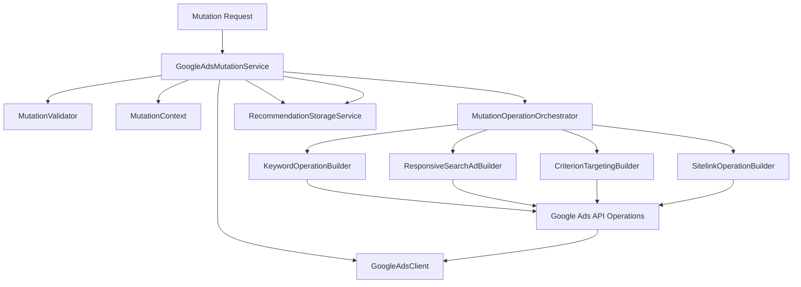

# Google Ads Mutation Service Documentation

## Overview

The `GoogleAdsMutationService` is a robust, asynchronous service designed to execute optimization recommendations on Google Ads campaigns. It translates high-level business recommendations (e.g., "Add keyword", "Update Sitelink") into Google Ads API-compliant mutation operations.

This service emphasizes:

- **Atomic Execution**: Operations are executed in an all-or-nothing transaction by default (`partialFailure: False`).
- **Statelessness**: No internal state is maintained between requests; all necessary context is derived from the input.
- **Modularity**: Responsibilities are strictly separated between coordination, validation, and operation building.

## Architecture

The service follows a composed architecture:



### Key Components

1.  **GoogleAdsMutationService** (`adapters/google/mutation/google_ads_mutation_service.py`):
    - The entry point. Coordinates validation, building, and execution.
    - Standardizes the API response and handles cross-component errors.

2.  **MutationValidator** (`adapters/google/mutation/mutation_validator.py`):
    - Centralizes business logic validation.
    - **Consolidated Keywords**: Uses a single `validate_keyword` method for both text length and match type validation.
    - **Proximity Limits**: Enforces a maximum radius of **800 km (500 miles)** and validates acceptable units (`MILES`, `KILOMETERS`).

3.  **RecommendationStorageService** (`core/services/recommendation_storage.py`):
    - Manages the lifecycle of recommendations in the database.
    - Handles the post-mutation synchronization, ensuring storage reflects applied changes without data loss.

4.  **MutationOperationOrchestrator** (`adapters/google/mutation/mutation_operation_orchestrator.py`):
    - Iterates through the fields in a `CampaignRecommendation`.
    - Dispatches each field to the appropriate `OperationBuilder` based on a mapping registry.

5.  **Operation Builders** (`adapters/google/mutation/operation_builders/`):
    - `criterion_targeting_builder.py` — Age, Gender, Location, Proximity targeting.
    - `keyword_operation_builder.py` — Keywords & Negative Keywords.
    - `asset_builders/text_asset_operation_builder.py` — RSA Headlines & Descriptions.
    - `asset_builders/sitelink_operation_builder.py` — Sitelink extensions.

## Workflow

1.  **Request Reception**: Receives `MutationRequest` containing `CampaignRecommendation` and `clientCode`.
2.  **Context Creation**: Initializes `MutationContext` with account and client details.
3.  **Validation**: `MutationValidator` checks for essential IDs and business constraints.
4.  **Orchestration & Building**: Operations are generated for each field.
5.  **API Execution (Atomic)**:
    - The batch is sent to Google Ads API.
    - **`partialFailure: False`**: If any operation in the batch fails, the entire request rolls back on the Google Ads side.
6.  **Storage Synchronization**:
    - Upon API success, `apply_mutation_results` is called.
    - The specific items mutated are marked as `applied=True` in storage using a robust merge strategy.
    - The record's `completed` status is updated based on the `isPartial` request flag.

## Storage Sync & `isPartial` Scenarios

The service supports partial application of recommendations where the request payload is only a subset of what's stored in the database.

### Merging Strategy

To prevent data loss, the service:

1.  **Partial Update (`isPartial: True`)**:
    - Fetches the full record from storage using the `_id`.
    - Matches incoming items using identifying keys (`resource_name`, `text`, `geo_target_constant`, `age_range`, `gender_type`, `link_text`).
    - Updates only the matched items to `applied: True`.
    - Preserves all other recommendations that weren't in the request.
2.  **Full Update (`isPartial: False`)**:
    - Directly updates the storage record using the provided payload (source of truth).
    - Sets `completed: True` and marks items as applied.

### Scenario: Partial Application

| Request `isPartial` | Storage Result                 | Record Status                  |
| :------------------ | :----------------------------- | :----------------------------- |
| **`True`**          | Subset of items marked applied | **Open** (`completed: False`)  |
| **`False`** (Full)  | Items marked applied           | **Closed** (`completed: True`) |

#### Example Walkthrough

**Initial Storage State:**

- 3 Keywords pending (`applied: False`)
- Record is Open (`completed: False`)

**Mutation Request:**

- `isPartial: True`
- Contains 1 of those 3 Keywords.

**Resulting Storage State:**

- 1 Keyword is now `applied: True`.
- 2 Keywords remain `applied: False`.
- Record remains **Open** (`completed: False`).

## Configuration Limits

Managed in `adapters/google/mutation/mutation_config.py`. Key system limits include:

| Component              | Limit                                 | Source                                                                                           |
| :--------------------- | :------------------------------------ | :----------------------------------------------------------------------------------------------- |
| **Proximity Radius**   | 1 - 800 km (500 miles)                | [System Limits](https://developers.google.com/google-ads/api/docs/best-practices/system-limits)  |
| **Keyword Match Type** | `EXACT`, `PHRASE`, `BROAD`            | [KeywordInfo](https://developers.google.com/google-ads/api/reference/rpc/latest/KeywordInfo)     |
| **RSA Headlines**      | 30 characters                         | [HeadlineConfig](https://developers.google.com/google-ads/api/reference/rpc/latest/AdTextAsset)  |
| **Sitelinks**          | 25 chars (Link Text), 35 chars (Desc) | [SitelinkAsset](https://developers.google.com/google-ads/api/reference/rpc/latest/SitelinkAsset) |

## Implementation Patterns

### Identifier-Based Merging

The `RecommendationStorageService` uses a priority lookup for merging:

```python
def get_uid(item):
    # Sequential identifies for various recommendation types
    return next((item[k] for k in ID_KEYS if item.get(k)), None)
```

## Error Handling

- **BusinessValidationException**: Pre-API validation failures.
- **GoogleAdsException**: Network or API errors returned by Google.
- **StorageSyncError**: Logged if the database update fails after a successful Ads API mutation (critical but doesn't fail the API response).
